# 2013

Complete list of design briefs advertised to students for 2013 group
design projects.

### Laser cutting round boxes from square sheets

<a class="brief-video" href="https://www.youtube.com/watch?v=ii1HvGO4sKk"
   title="Watch the Group Alpha project video on YouTube">
  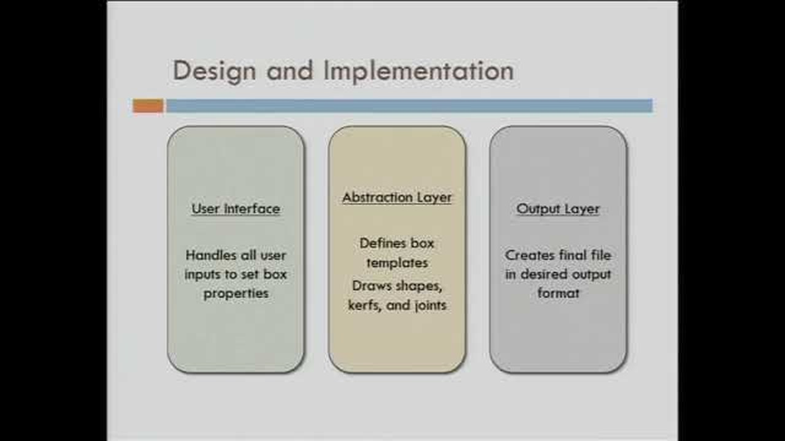
</a>

Client: Dr Laura James <LBJ@cantab.net>, Cambridge MakeSpace

Kerf bending is a cute method for making round boxes with a laser
cutter, but it requires quite a bit of planning. The goal of this
project is to build a system that can be used by customers to design
their own wooden boxes in arbitrary shapes (e.g. letters of the
alphabet), with the templates for the round sides automatically produced
using kerf bending. The resulting pieces should be suitable for posting
in a flat-pack format, in as few pieces as possible, with tongue and
slot assembly. Examples of the resulting designs will be fabricated
using the Computer Laboratory laser cutter.

Background on kerf bending:
<http://hackaday.com/2012/06/12/bending-laser-cut-wood-without-steam-or-forms/>

Special resource - interfacing details and access to laser cutter will
need to be arranged with Brian Jones <bdj23@cam.ac.uk>

### Touch screen prototyping at school

Client: Ian Hosking, Engineering Design Centre <imh29@cam.ac.uk>

Touch screen prototyping at school

Secondary school design and technology teaching includes an emphasis on
inclusive design - creating products that are available for use by a
wider range of the population. At present, school students don't get to
learn about interactive software design, but they probably know that
products like touch-screen smart phones are a major obstacle for their
grandparents, and students should have a chance to learn about how to
improve matters! Your task is to create a low cost system for
prototyping new touch screen interfaces, that is sufficiently easy to
use that 12 and 13 year-olds can experiment with alternative phone
designs. The whole system should be sufficiently compact that it can be
deployed on a Raspberry Pi (we can supply large touch screens that can
be interfaced to the Pi).

### Measuring glass-to-glass video-conference latency

Client: John Bain, Cisco <jbain@cisco.com>

A key consideration in the design of video-conferencing systems is to
minimise the latency added to the video and audio, since this can have a
marked effect on the naturalness of communication. Many software
solutions exist for measuring various aspects of the system latency, but
there is no substitute for end-to-end (often called glass-to-glass,
referring to the lens of the camera and display screen) measurements of
video and audio latency. This type of measurement has traditionally been
subjectively measured by humans, and is hence prone to error and bias.
Your task is to automate this by presenting an audio plus video signal
to one end of a video-conference link, and measure the latency of the
screen/speaker output at the other end. The two ends may be
geographically separated - even in different continents. The Altera
teaching board will be used to provide I/O facilities. Some technical
ingenuity will be involved in ensuring that any delays or offsets in
measurement are accounted for.

### Reliable cycle-aware traffic light

<a class="brief-video" href="https://www.youtube.com/watch?v=V1pdR9uBLG0"
   title="Watch the Group Bravo project video on YouTube">
  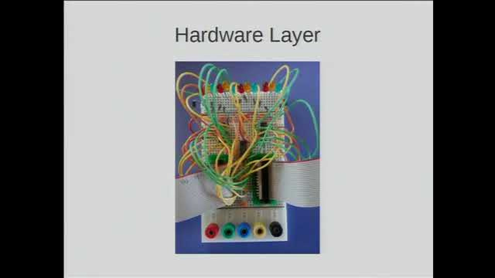
</a>

Client: Nigel Day, ENEA <Nigel.Day@enea.com>

Most central Cambridge junctions snarl up at critical moments between
lectures, with accidents, broken limbs and worse as students jump red
lights after realising they are running late. Your task is to create a
fault-tolerant traffic light controller (using a pair of Raspberry Pis
with a hardware fail-over), that builds a traffic model based on weather
data, university building management systems, bus timetables, and any
other data sources that you can discover to accurately predict cycle
volumes. This database should be combined with traffic sensor data to
invent a new cycle-aware junction control model.

### Scrobble Exchange: A massively multiplayer game

<a class="brief-video" href="https://www.youtube.com/watch?v=VXdE6coopdo"
   title="Watch the Group Charlie project video on YouTube">
  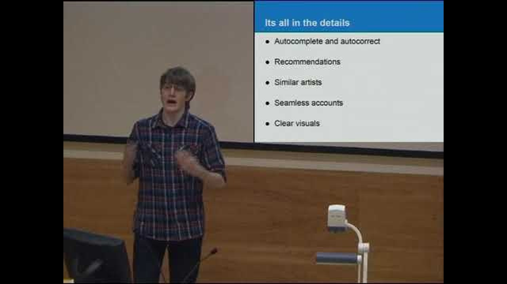
</a>

Client: Sunil Shah, Last.fm - sunil@last.fm

Scrobble Exchange - A Massively Multiplayer Game

Last.fm is the world's most popular music recommendations website with
tens of millions of users. Users
scrobble<<http://www.last.fm/help/faq?category=Scrobbling>> tracks
that they listen to, which we collate into charts which show the most
popular artists and tracks and can be filtered by geography and genre.
Using our extensive API<<http://www.last.fm/api>>, this project's goal
is to create an online multiplayer game where users can invest in a
portfolio of artists and gain returns based on the performance of their
portfolio. The mechanics of the game are up to you but you should take
steps to prevent cheating, and implement market dynamics so users'
behaviour has a visible effect on the market price of an artist. A
successful project would likely see implementation on Last.fm and be
made available to our large userbase, so scability is a key design goal,
as is portability to the Last.fm operating environment (Python or PHP
against a Postgres database under Debian Linux).

### Safer social media

<a class="brief-video" href="https://www.youtube.com/watch?v=q-Ub9ycCYXk"
   title="Watch the Group Delta project video on YouTube">
  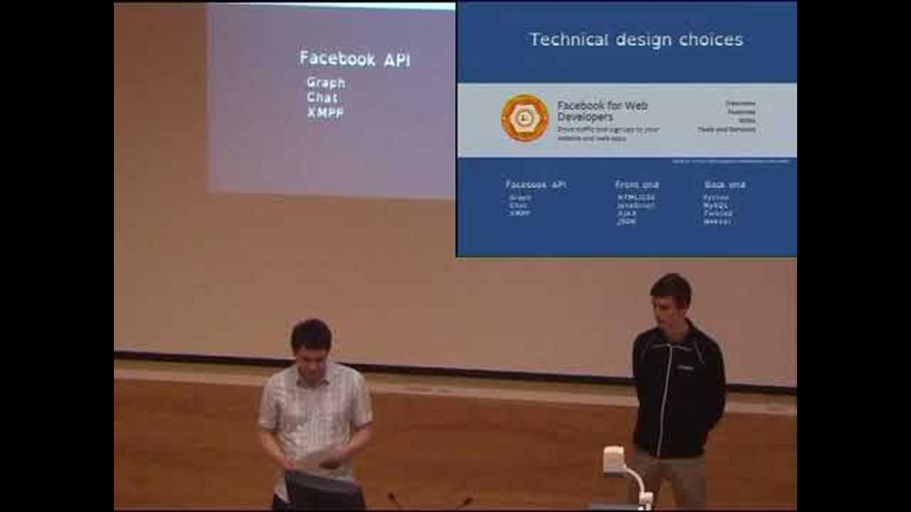
</a>

Client:David Kynaston <E.Kynaston@btinternet.com>

Young people with learning disabilities such as Down's Syndrome, ADHD or
dyslexia are increasingly excluded from social media opportunities. Your
goal in this project is to create a new front end for Facebook (using
the Facebook API) to provide a straightforward set of social functions
optimised for users who have very limited ability to use text in any
form. Rather than the single-user mode of typical Facebook usage, it is
also likely that a parent or carer may need to assist or review
interactions. Your design should take account of this in a sensitive
manner, including considerations of privacy and vulnerability.

### Personal/national mood tracker

<a class="brief-video" href="https://www.youtube.com/watch?v=LverEoB0V54"
   title="Watch the Group Echo project video on YouTube">
  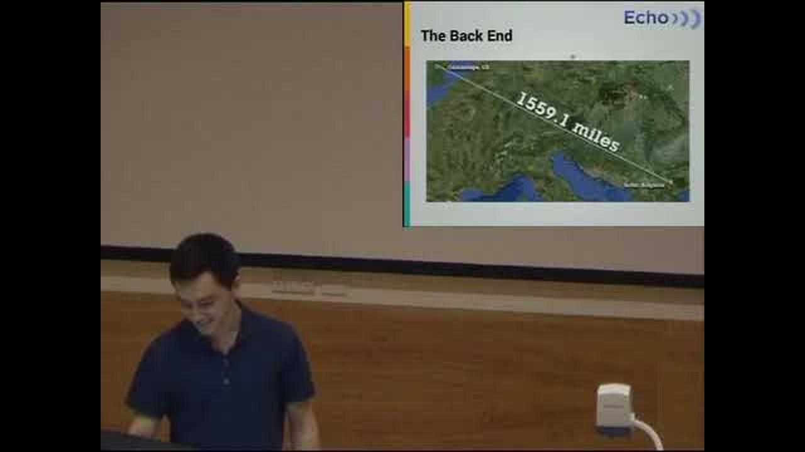
</a>

Client: Tomas Cervenka, VisualDNA <tomas@visualdna.com>

National wellbeing is the aggregate of the population mood, but it's
difficult to know whether mood estimates are accurate or not. In fact,
even individuals find it difficult to estimate how their mood has
changed over time. The goal of this project is to automatically estimate
a number of factors that effect national mood - news, weather, economic
indicators - and aggregate these with personal mood estimates measured
via your mobile phone's sensors. These could include movement or
orientation data (facing into the wind?), feeds from a Facebook profile,
or other data. If users are unsure what mood they are in, they can check
their phone. And a longitudinal graph might help to review the year, or
forecast important mood transitions - like when the end of term is
approaching.

### The Poet Laureate's web thresholds

Client: Vicky Smith, StrideDesign <vicky.smith@stridedesign.com>

The Poet Laureate Carol Ann Duffy has appointed 10 leading poets to work
with Cambridge University Museums and young people from the county. Your
task is to provide a novel tool that can emulate the exact layout of any
page from a museum web server, but with the original text (perhaps
partly) removed. Invited poets and young people should be able to
substitute their own poetry or other text by typing directly over the
visual layout as if in a drawing editor. These transformed pages can
then be published and viewed from an alternative server that offers a
"mashed up" version of any museum page for public viewing. The technical
challenge is to give users the impression that they are really typing
directly onto the rendered web page, as if onto a piece of paper, and to
do so in a way that emhasises typographic freedom, allowing poets direct
control over all concrete aspects of the juxtaposed text.

### Countryside web server

Client: Peter Cowley, CamData <peter.cowley@camdata.co.uk>

A ruggedized version of the Raspberry Pi can be used for outdoor
applications, like monitoring wildlife activity via USB peripherals
(e.g. GPS) analogue and digital inputs (e.g. monitoring the weight of
nesting birds, or entries to a burrow). The kinds of hobbyist and
researcher who do this need to specify data capture via a rubberised
keyboard and LCD display, but also make that data available more widely
via popular websites. Your task is to design a system that allows users
to configure battery-powered data capture and website structure in the
field via the embedded display, but then turn the same device into a
fully-functional web server with data visualisations when it is brought
inside and plugged back into a network port. If required, you will also
be provided with a licence for the ENEA Polyhedra realtime embedded
database.

### Race the wild

<a class="brief-video" href="https://www.youtube.com/watch?v=RvolvE1A_t8"
   title="Watch the Group Foxtrot project video on YouTube">
  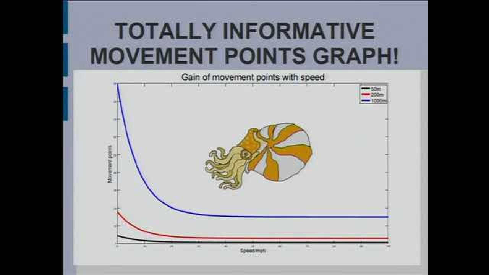
</a>

Client: Craig Mills, United Nations Environment Programme World
Conservation Monitoring Centre <Craig.Mills@unep-wcmc.org>

The UNEP-World Conservation Monitoring Centre wants to improve public
engagement with wildlife conservation. One very successful approach is
to help those interested in wild animals to learn more about their daily
activities, and to imagine the environments that the animals have to
survive in. The goal of this project is to create a game that runs on a
mobile phone platform, allowing players to compare their own movements
to those of wild animals that are fitted with satellite tracking
devices. You are free to design a game scenario in any genre that makes
use of play location data and animal tracking information.

### Password and privacy protection with Pi

<a class="brief-video" href="https://www.youtube.com/watch?v=5xSSXbvl9hU"
   title="Watch the Group Golf project video on YouTube">
  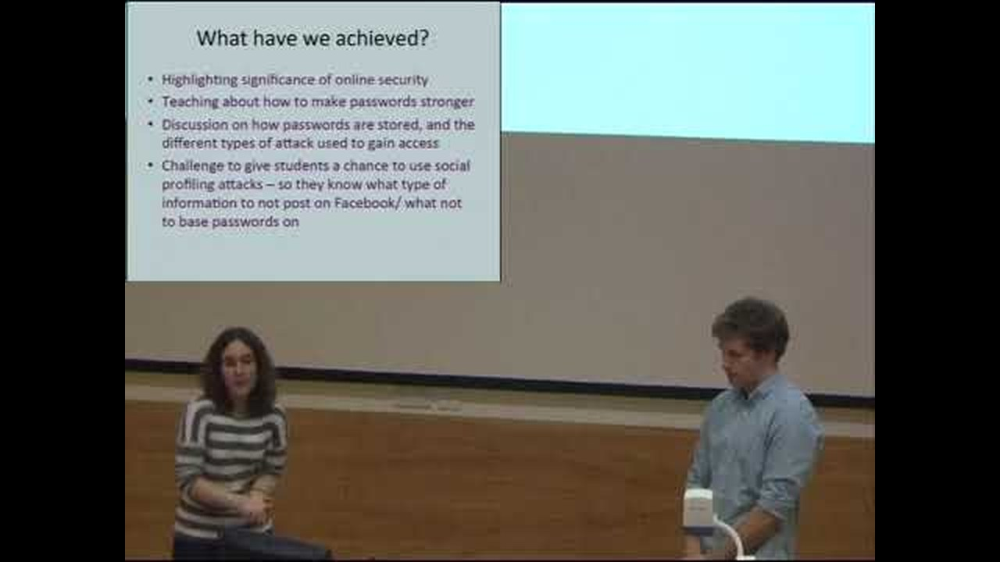
</a>

Client: Luke Morgan, IBM <MORGANLU@uk.ibm.com>

Few children (or even adults) really understand what makes a password
secure, or how to keep their online information safe. Your task is to
create a simple set of password cracking and message
encryption/decryption tools that children can run on the Raspberry Pi,
together with a scripting language or GUI for them to run simple
statistical experiments to understand what factors make their messages
more secure. Children love code-breaking, so it should be easy to make
this into an entertaining Raspberry Pi game, not just boring school
work.

### From Hogwarts to hackers

<a class="brief-video" href="https://www.youtube.com/watch?v=AB3JhsobXZA"
   title="Watch the Group Hotel project video on YouTube">
  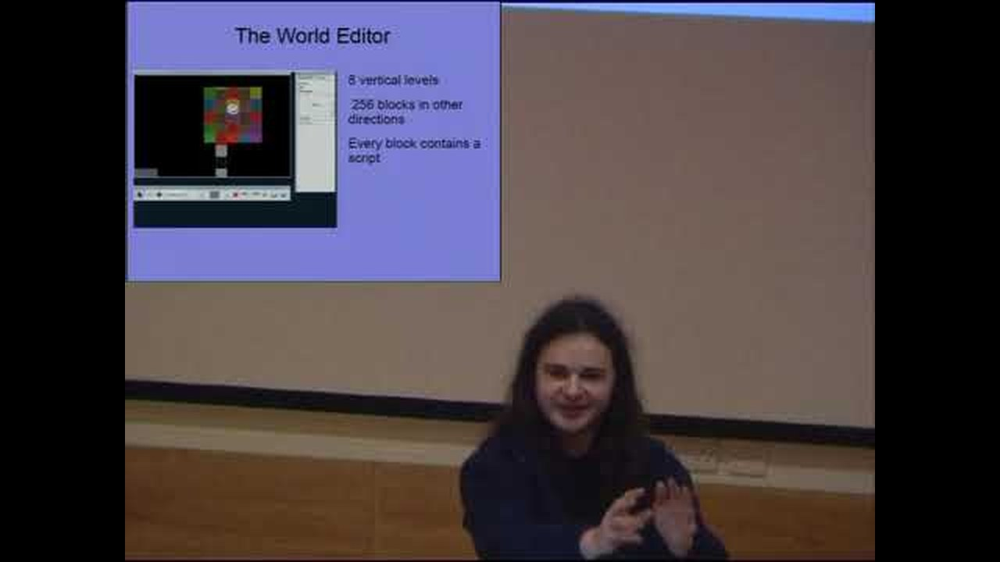
</a>

Client: Jeff Patmore, Engineering Design Centre <jjp43@cam.ac.uk>

Many children are more interested in imaginative stories than tinkering
with circuit boards. But they need not be excluded from Raspberry Pi.
The goal of this project is to create a multiplayer online game, where
each room of a castle runs on a different Raspberry Pi. The owner of
that Pi should be able to define surroundings, objects, characters and
scripted interactions (e.g. to learn spells or solve challenges) as well
as visiting other player's rooms. Players get to learn about network
topologies, scripting languages and command lines - but all while having
sociable fun. A text adventure game might be the best choice - for
example, of the kind that can be created with plot scripting language
Inform7, or LambdaMOO, but you are free to attempt simple graphics or
other presentation styles.

### A platform for live online modding

<a class="brief-video" href="https://www.youtube.com/watch?v=guXUIHzt5gk"
   title="Watch the Group India project video on YouTube">
  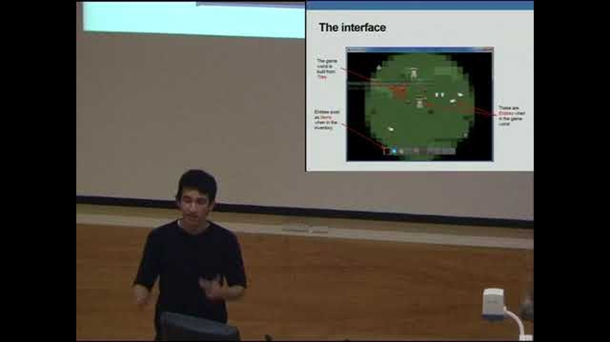
</a>

Client: Matt Johnson, Frontier <mjohnson@frontier.co.uk>

In sandbox games like Minecraft, the only way to define more interesting
game scenarios is to write and install Java mods. It is possible to make
automatic behaviours in the Minecraft world, but only using the
cumbersome "redstone" logic blocks. The goal of this project is to make
a new multi-player sandbox game, based on a 2D grid, where users can
define more complex behaviours by clicking on a grid element to embed
pieces of code written in a scripting language like Lua. You are welcome
to use a commercial or open source rendering engine, but maintaining a
shared persistent world will still involve solving problems of
persistence, networking, live world management and session control.

### Hashtag-FollowTheMarket

<a class="brief-video" href="https://www.youtube.com/watch?v=bxw4uLOwz4U"
   title="Watch the Group Juliet project video on YouTube">
  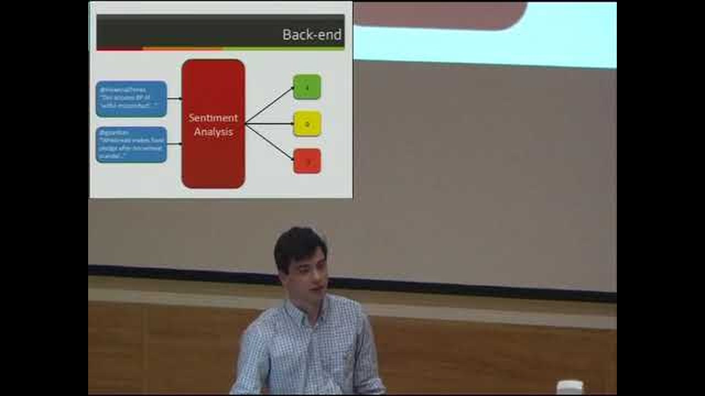
</a>

Client: David Rubin, Bloomberg <drubin19@bloomberg.net>

Sentiment analysis of social media is now fairly routine, but it's still
relatively new in the world of finance. Coupling popular sentiment with
market data could provide a very useful tool for financial decision
makers. Your task is to derive sentiment data from Twitter and present
its relationship to market data in a tool for traders to test their
knowledge of the market. The user selects a date range and a stock, and
is then asked to sketch a graph of how they believe popular sentiment
and stock price trends behaved over that time. The system gives visual
feedback, and awards a competition score based on comparison to the
actual data. This system might be used simply for practice and training,
or as a game for would-be traders. But in the long term, statistical
data showing the ways in which the judgments of real traders predict (or
lag) Twitter trends might provide an extremely valuable product!

### Science exhibit interaction adviser

Client: Dave Ansell, Cambridge Science Centre
<dave@cambridgesciencecentre.org>

The newly established Cambridge Science Centre is building a major
interactive public science exhibition space in Cambridge. We want this
to be the best of its kind in the world! One issue faced by interactive
science exhibits is the tendency for visitors to play with the knobs and
handles in a random way, without the guidance that might make the
discovery experience more enjoyable and educational. The goal of this
project is to make a configurable exhibit monitor (delivered via an
embedded Raspberry Pi), that will prompt visitors to explore behaviours
they haven't yet seen. This should have a simple authoring language
associated with it (perhaps configured via a flow chart) that describes
possible exploration paths, and allows a scientific adviser or exhibit
designer to tag those that appear to be off-topic, incomplete or
unhelpful. Configuration and review of interaction statistics should be
available remotely, via a network connection to each exhibit equipped
with one of these devices.

### Personal status server

Client: Chandra Harrison, Qualcomm <c_charri@qti.qualcomm.com>

There are several ways that computers can "read your mind" by observing
emotional state - measuring skin conductance, or even estimating pulse
rate with a camera pointed at your face. A dedicated device like the
Raspberry Pi could run its own web server, serving a single page that is
modified according to the detected emotional state of the user. Of
course, it should be possible to customise this behaviour with a simple
end-user language, so that different texts or images are included in the
page in response to different detected emotions. Finally, friends should
be able to add their own supportive feedback to the page ... using
appropriate security!

### Rule-tris introduction to programming

<a class="brief-video" href="https://www.youtube.com/watch?v=pcAXlsq24sc"
   title="Watch the Group Kilo project video on YouTube">
  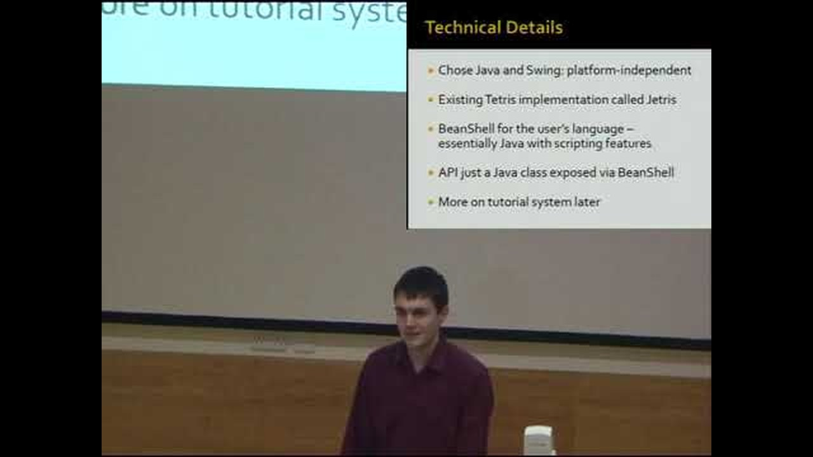
</a>

Client: Luke Tunmer, Qualcomm <ltunmer@qti.qualcomm.com>

All kids love Tetris, so why not help them learn programming by making a
Tetris-playing robot? You need to start with a simple Tetris port on the
Raspberry Pi (code your own, or use an open source version), then add
facilities allowing kids to "play" it automatically with the assistance
of an interpreted rule language. This language can be applied by users
to define piece rotations and movements based on queries of the current
game state and simple algebraic expressions. The rule condition queries
and actions must be sufficiently constrained that it would take
significant coding effort to make an optimal player, but should also be
simple enough to provide incremental feedback for students, so that each
new rule (if correctly specified) produces satisfying improvements.

### Terabyte threat analysis

<a class="brief-video" href="https://www.youtube.com/watch?v=makoRYXejfM"
   title="Watch the Group Lima project video on YouTube">
  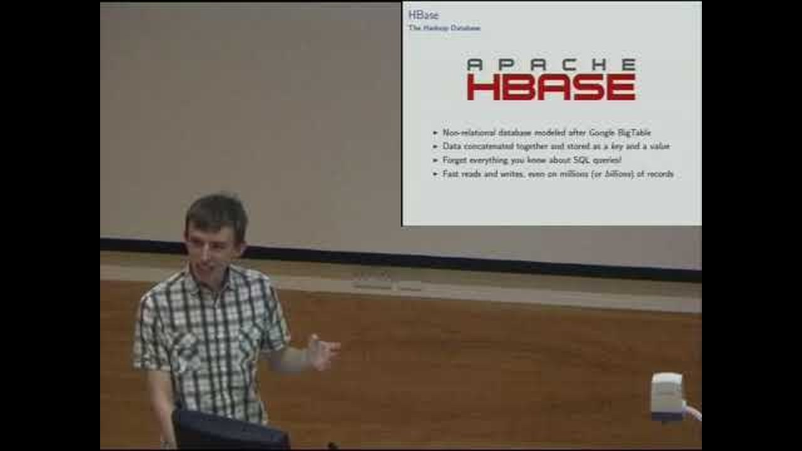
</a>

Client: Paul Reid, BT <paul.reid@bt.com>

Large networks such as the BT phone network generate terabytes of
routing metadata, but the size of the dataset makes it difficult to
interact with that data in realtime. This means that threats to the
network - whether natural disasters or intentional attacks - may not be
recognised until it is too late. Your task is to create a threat
visualisation and rapid response tool that uses the Hadoop distributed
data framework to identify network vulnerabilities from data traffic
analysis, and helps to plan and prioritise technical responses.

### Friend meeting/tracking application for the Elderly

<a class="brief-video" href="https://www.youtube.com/watch?v=rjOGi4VikX8"
   title="Watch the Group Mike project video on YouTube">
  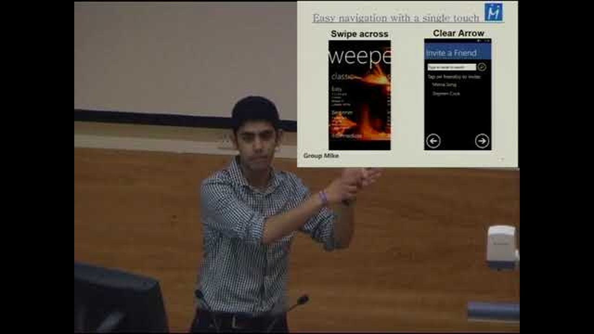
</a>

Client: Austin Donnelly, Microsoft Research
<Austin.Donnelly@microsoft.com>

Elderly people sometimes need help to remain active and social. This
project explores how a smartphone can arrange social gatherings/
meetings for them. This might include encouraging people to meet up by
locating their friends, perhaps notifying them that a friend is nearby,
and maybe even suggesting a location to meet. It may also be useful as a
monitoring device for patients who make a habit of wandering off,
distressing their family and carers. The user interface is important,
since it must be accessible to those with less good eyesight and hand
coordination. There will be little credit for boilerplate features such
as user registration, account maintenance and database design, rather we
expect to see innovative technical solutions to the user interface,
messaging, security (privacy) and identity. The final goal is a Windows
Phone 7 application that has been accepted into the Marketplace for
general availability. Phones will be provided for testing.

Note that Windows Phone 7 development requires .NET tools, so the
development language for this project will either be C#, F# or VB.

### Cycle path mapping with a custom hardware platform

<a class="brief-video" href="https://www.youtube.com/watch?v=ybO4F_lyzFQ"
   title="Watch the Group November project video on YouTube">
  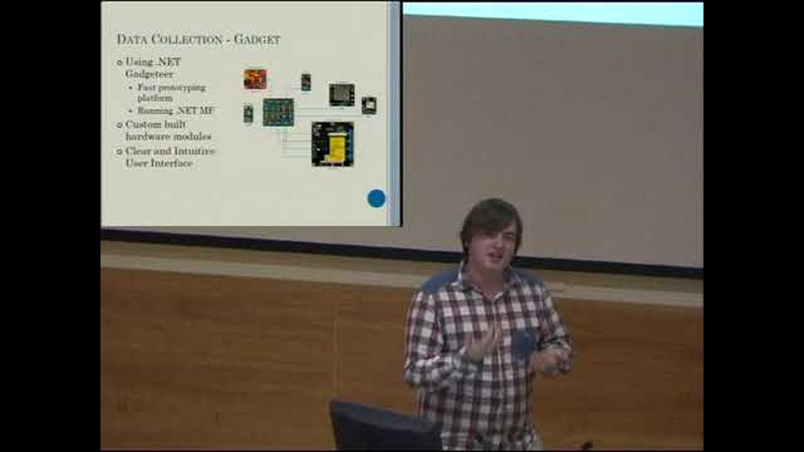
</a>

Client: Steven Johnston, Microsoft Research <v-stejo@microsoft.com>

The aim of this project is to produce a highly accurate map of the
Cambridge cycle network including information about inclines, one way
roads, restricted access. Since this will require more data than can be
gathered using a simple GPS device or smartphone this project will have
a custom hardware element based around the .NET Gadgeteer platform. The
first part of the project will build a device to capture data such as
GPS, accelerometer, compass, cadence, wheel rotation, heart rate etc, to
produce a sample dataset representative of the Cambridge cycle network,
as well as providing the cyclist with relevant data.

The second part of the project will process and visualise the sample
dataset. This will include removing erroneous data, fusing data streams
and maps to improve accuracy and inferring cycle features from the data
whilst keeping an emphasis on data accuracy. This information could be
used to recommend cycle routes or diversions in real time, assist with
finding a bike rack, or perhaps the addition of new cycle lanes. The
resulting dataset should be open and accessible.

Note that Gadgeteer development requires .NET tools, so the development
language for this project will either be C# or VB.

## Introduction and results

The 2013 playlist also contains the session's opening talk and the
presentation of the results, which are not tied to a single brief.

| Video | Watch |
| --- | --- |
| Introduction by Dr Alan Blackwell | [Watch on YouTube](https://www.youtube.com/watch?v=dO44ct-Z_Vk) |
| Results | [Watch on YouTube](https://www.youtube.com/watch?v=LCjRgSovPzY) |
