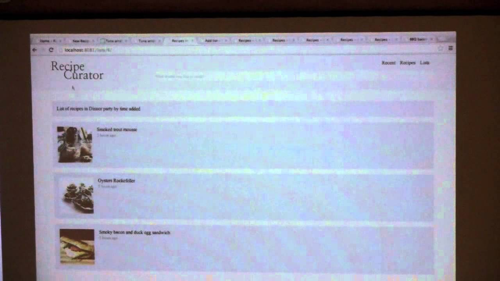
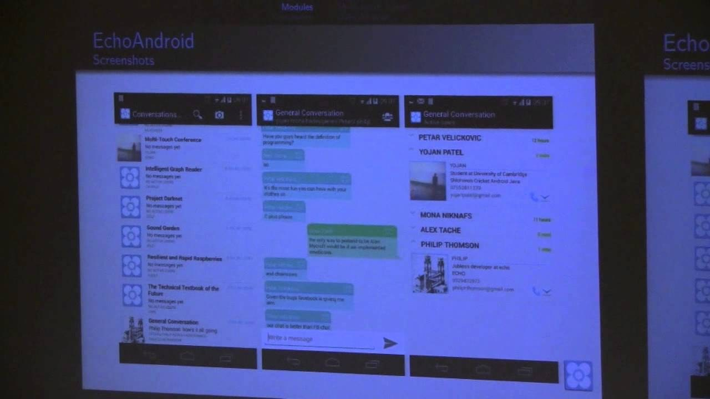
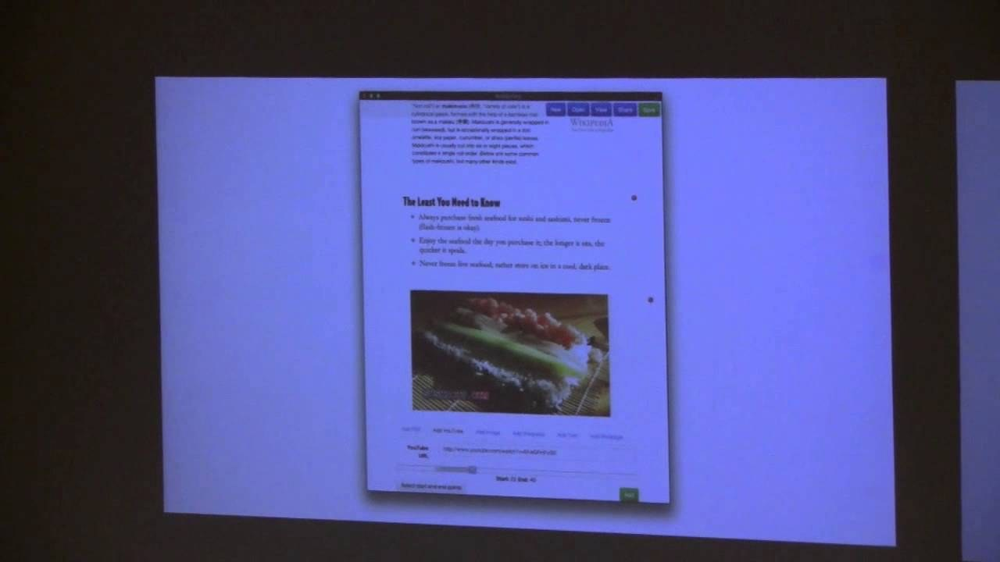
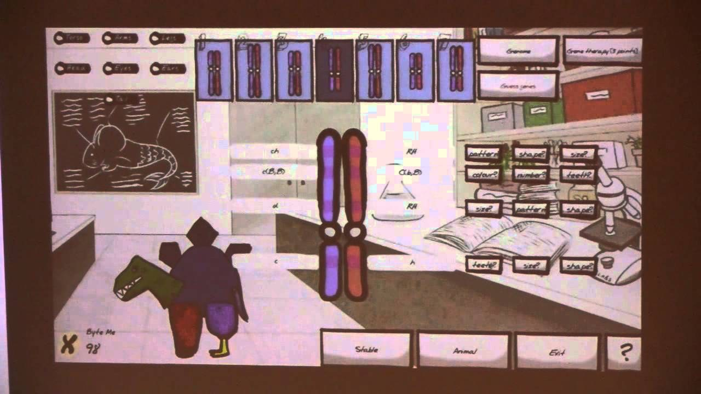
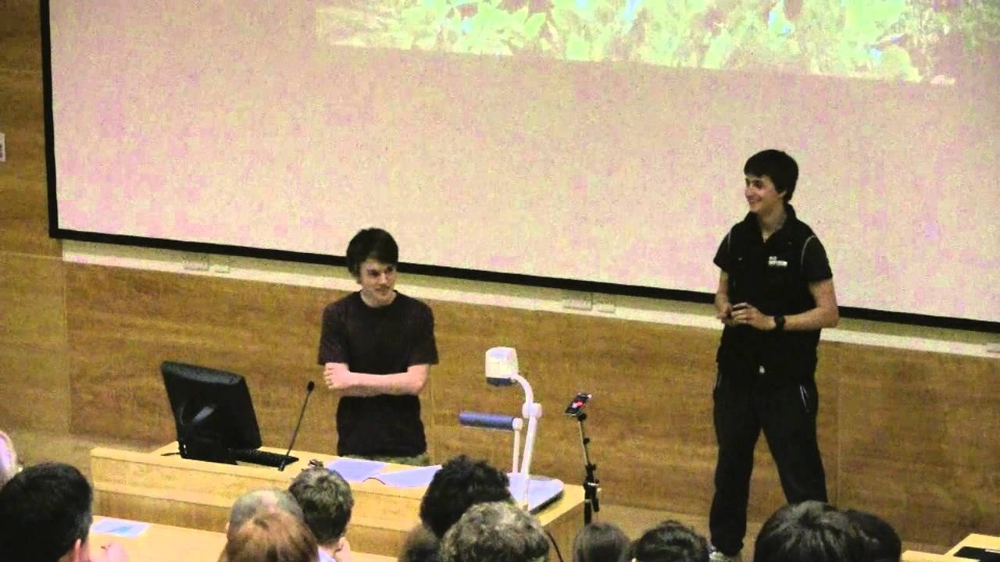
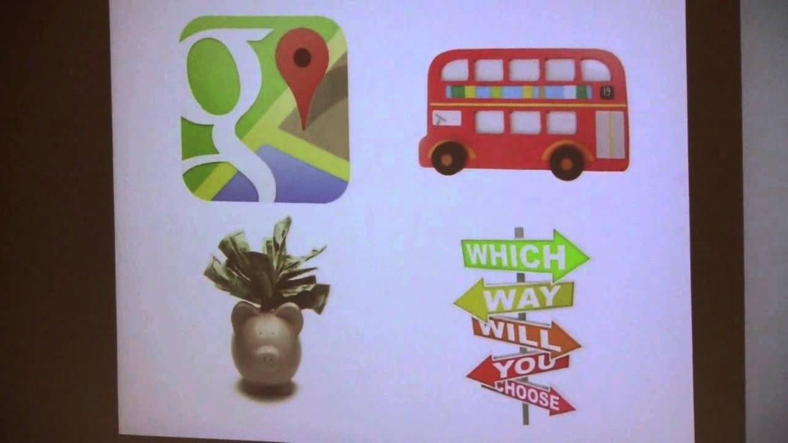

# 2014

Complete list of design briefs advertised to students for 2014 group
design projects.

### Multi Chat

Client: Matt Johnson, [Frontier](Frontier)
<mjohnson@frontier.co.uk>

Many games allow online players to chat in one form or another. More
adult games allow free chat in lobbies, or within the game. Some
products with younger appeal allow regimented exchanges of ‘phrases’,
such as ‘I’m the fastest’, ‘This time let’s play Rainbow Road’ to avoid
inappropriate discussion.

Both of these formats have drawbacks, either being too limited to make
meaningful conversation, or too open for inappropriate behaviour and
abuse.

Create a tool and module to provide a multiperson chat experience based
on a configurable grammar where the users can converse through the
stringing together of grammatical tokens to make meaningful, but limited
conversational exchanges.

The module should provide both a lobby and an ingame mode of
conversation, and provide configurable options for the tokens visual and
aural representation.

### Recipe Curator

Client: Chris Roberts <chris.roberts@cambridgeconsultants.com>
[Cambridge Consultants](Cambridge_Consultants)

One area of my life that could do with the addition of a bit of
technology is recipe curation. I have a shelf full of cookery books, a
few websites that I like, and I occasionally get given recipes by other
people. I also have a veg box delivery with unpredictable contents, a
desire to eat seasonal ingredients and try new recipes, a variable
availability of cooking time, two daughters with a only partially
overlapping Venn diagram of food fussiness and not a poor memory. What
I'd like is some sort of database of recipes to which I can send queries
such as "Find me something that doesn't contain cabbage or tomatoes that
takes less than 30 minutes to prepare" or "I've got kohlrabi in the veg
box AGAIN, are there any recipes I haven't tried that might make
something edible out of it?" or "I've actually got a couple of hours
free to cook this weekend, what was that complicated Ottolenghi recipe I
flagged two weeks ago to try later?" The database needs to cope with the
fact that ingredients can have different names but mean the same thing:
e.g "flour" and "plain flour", and that "1/4 lb" and "4oz" are the same
thing and equal to "100g" (and not 113g). It would be great if once I've
chosen this week's menu, it could produce a shopping list I can plug
into www.<my_favourite_supermarket>.com, and it needs to have a high
WAF, i.e. be usable by non-engineers.

### Multi-touch Conference

Client: Catherine White, [BT](BT) <catherine.white@bt.com>

Rather than flying all over the world to attend meetings and
conferences, it seems as though governments and businesses could save
money and time by collaborating remotely. Existing collaboration tools
such as Webex and Google Hangouts work quite well to connect small
groups of people together for a single presentation or discussion.
However, the networking aspect of real world conferences is missing in
these tools. During face to face networking sessions small clusters of
people form and many different conversation threads are generated.
Delegates can walk between groups of people, joining in with
conversations that interest them and introducing themselves or saying
hello to people they would like to speak with. There might easily be
several specialised sub-topics being discussed at the same time. Your
task is to create a multi-touch, multi-user browser extension that lets
groups of people convene and spontaneously form discussions in a
simulated networking session. The screen might be used to connect local
special interest meetings to other similar meetings around the globe.
Sub groups should be able to see who they are talking to in other
places, and a single large screen should support multiple users at the
same location contributing to more than one topic at the same time. You
may like to use the theme to enhance the conversations that emerge, by
for example extracting the keywords and themes and forming an indicator
above each conversation cluster indicating the topic. The interface
should be as simple and usable as possible, without requiring
significant training. It may be more important to order the conversation
clusters and avatars in terms of relevance and relatedness than to place
people into a simulated geographical setting. Each user may have an
additional device such as a smart phone or wireless keyboard which can
be used for typing messages.

### Money World

Client: Ben Azvine, [BT](BT) <ben.azvine@bt.com>

UK voters are quite accustomed to seeing good quality visualisations of
economic data, tax and public expenditure. But these aren't accessible
in many parts of the world having low literacy, or where the only
internet access is via the mobile network. Your task is to create an app
that will run on a low cost Android phone, not using too much bandwidth,
that allows developing world users to visualise, share and comment on
economic data. Initiatives such as Gapminder, Africa's Voices and the
Open Data Initiative might provide a starting point for design ideas,
but you'll need to think about what information sources are both useful
to developing world users and publicly available -
www.globalintegrity.org is one organisation with the right kind of
focus. You could consider designs based on the Mo Ibrahim Foundation
indices, or even allowing citizens to see how their country compares to
others on the Millennium Development Goals. Keep in mind that the kinds
of visualisation suitable on a small screen will be very different to
what might appear on a newspaper site. JavaScript visualisation
libraries might come in handy, for example using a platform like
PhoneGap. In any case, users should be able to find out how the
visualisation was derived from the data, so that people in other
countries can share, reuse or extend it.

### Virtual Reality Trading Desk

Client: Taylan Toygarlar, [IMC
(Netherlands)](IMC_(Netherlands)) (Taylan.toygarlar@imc.nl)

Financial markets today are one of the biggest raw data generators of
our time, with billions of data points per day for some products. Most
traders need to digest a very large number numerical and graphical
inputs - they use four, six, eight or more screens - but can't see or
reach all the data they need. In this project, you will use an Oculus
Rift VR headset to distribute market data and visualisations in the
virtual space around a trader. By turning their head, or looking up and
down, they should be able to review rapidly changing data in various
formats, and have their attention drawn to the most urgent changes if
they need to act. The design of the visualisations could emulate those
found in products such as Thomson Reuters Eikon - but it will be
necessary to adjust these to the display characteristics of the Oculus
Rift.

### Algo-Trading Game

Client: Radmilo Racic, [IMC (Netherlands)](IMC_(Netherlands))
<Radmilo.racic@imc.nl>

Algorithmic trading is an essential part of today’s financial markets,
but releasing an algorithm out in the wild certainly comes with its own
hassles. One of the challenges associated with carrying a trading
algorithm into production is the evaluation of its performance,
preferably under different market conditions, and using different
parametrizations of the algorithm. This process, called back-testing,
allows one to understand the characteristics of a trading algorithm
before it hits the markets. In this project, the aim is to create a
game, where users will submit their algorithms to be evaluated under a
back-testing framework. An algorithm will pick which products it is
interested in, and the framework will supply the historical data for
those products. The algorithm can then give trading decisions, which
will be evaluated in order to characterize the algorithm.

### Intelligent Graph Reader

Main client: Nilu Satharasinghe, [Sparrho](Sparrho)
<nilu@sparrho.com>

Additional contact: Vivian Chan <vivian@sparrho.com>

Google Scholar is a good way to find scientific results, but it only
reads the words - not actual data. The goal of this project is to create
document analysis algorithms that can automatically identify and
describe graphs of scientific data - something like "find a graph where
blood pressure decreases with age". Users should be able to feed in
complete HTML or PDF documents, which are automatically parsed for graph
content, and stored in an archive that supports sophisticated data
queries and comparisons between graphs in different documents.

### The technical textbook of the future

Client: Rupert Gatti, [Open Book
Publishers](Open_Book_Publishers)
<rupert.gatti@openbookpublishers.com>

In fast-moving technical fields, it is hard to keep good textbooks up to
date. Online resources such as wikipedia are useful ways to collect
expertise, but articles written by technical experts are not always the
best way to learn. It's hard work to collect good teaching examples,
suggest tests and exercises and so on. Your task is to design an
application that offers the best of both worlds - a book that can be
accessed from browsers or mobile devices, preserving a clear voice for
the author, but also allowing mashups at varying levels of granularity
with other textbooks, student forums, class exercises and presentation
materials, and discussion among expert teachers at any level of content.
Different users (schools, teachers, or learners with special needs)
should be able to create the learning paths that suit them best, and
also share them with others. The final product shouldn't look like
another blog, forum or wiki - you will need to think what design
elements and user experiences are associated with a professional and
authoritative knowledge source.

### Resilient and Rapid Raspberries

Client: Dominic Nancekievill, [G-Research](G-Research)
<Dominic.Nancekievill@gresearch.co.uk>

In today’s world of high frequency trading, understanding the rapidly
changing quotes from a myriad of trading algorithms is a colossal data
processing problem. With tens of thousands of updates per second in a
single market, and limited space and power constraints, it is important
to be able to maximise throughput and resiliency with the hardware
available. Given a day of actual stock exchange data, your challenge is
to create a cluster to process and aggregate the data. Doing this with
real hardware is more fun - we can’t give you our data centre, but we
can supply you with a Raspberry Pi cluster.

Dynamically dealing with hardware failure, visualisation of the order
book, automated deployment and performance statistics are all areas that
you can explore.

We have supplied the Computer Lab with some additional notes indicating
where you can find sample data to work with and giving a little
background information. Please collect a copy of these notes (and some
Raspberry Pis and other kit) before getting started.

#### Additional Notes

Firstly, you will need some sample market data to work with. The New
York Stock Exchange (NYSE) have a page describing their ARCA feed at
<http://www.nyxdata.com/page/1084>. At the bottom of the page are two
tabs: “Specifications” and “Sample Data”. Download everything from both,
then follow the instructions in “NYSE Arca Integrated Feed Sample Data
Directory Layout” to download the sample data.

The specifications provide all the information required to decode the
sample data, however they are written for an audience with a basic
understanding of how financial markets work. See “A Brief Introduction
to Financial Market Data” below for a few notes which might be worth
reading before getting started with NYSE’s spec.

Architecture-wise, it’s OK to write something on an ordinary PC to read
the sample file and distribute messages from it over a network. You can
then use the Pis to pick up the messages, display order books and
compute analytics. You do not necessarily have to write a decoder for
every message type in the specification – the lion’s share of the
messages will be trades and order book updates, these are the most
interesting things to visualise or compute analytics from but they only
use a small number of the message types.

##### A Brief Introduction to Financial Market Data

The data in the sample file is an example of the market data an
electronic trading system would receive from the NYSE Arca exchange
during a trading day. Messages in the other direction (orders from the
electronic trading system to the market) are not included. Market data
messages generally serve one of three purposes:

1.  To update clients on the current state of the market, e.g. “the
    market is now open”, or “trading in Vodafone shares has been
    temporarily suspended”.
2.  To indicate when trades have occurred, e.g. “200 shares of Vodafone
    have been traded at a price of £2.22/share”.
3.  To describe the current state of the order book for each product
    traded on the market (more on order books below).

Most financial markets use some variant of a central limit order book.
The easiest way to explain this is by example:

Suppose I want to buy 1000 shares in Vodafone and I’m willing to pay up
to £2.21/share. I would send an order to the exchange saying as much. To
begin with the exchange doesn’t have a seller willing to sell to me so
it records my order on the order book for Vodafone and disseminates it
to all market participants via the market data. The order book has a bid
side (indicating potential buyers with how much they want to buy and
what price they’re willing to pay) and an ask side (indicating the same
for sellers). After my order the book looks like this:

`No Ask`
`--`
`Bid 1000 @ £2.22`

Now suppose someone is willing to sell 500 shares but they won’t take
less than £2.24. Their order doesn’t match mine because we disagree on
price, so their order goes onto the book too and it looks like this
(note that this isn’t a terribly good way to visualise an order book –
just one that works in email where any formatting I add may be mangled –
you can do better in the visualisations you’ll write for the Pis):

`Ask 500 @ £2.24`
`--`
`Bid 1000 @ £2.22`

Suppose another seller comes along with a better price, and another
buyer offers a worse price. The order book is sorted by price so it
might look like this (there have still been no trades):

`Ask 500 @ £2.24`
`Ask 800 @ £2.23 (New seller)`
`--`
`Bid 1000 @ £2.22`
`Bid 2500 @ £2.17 (New buyer)`

A bit of terminology before continuing: My order to buy 1000 @ £2.22 is
the highest bid price, which is referred to as “best bid”. Similarly
£2.23 is the lowest sell price, “best ask”. The best bid and ask prices
are collectively called “top of book” or “touch”. The difference between
the two touch prices is the “spread”, currently £0.01 in this example.
Prices can be in fractions of a penny (although they aren’t in my
example) – the minimum price increment is defined by the exchange on a
per-product basis.

Now imagine I decide that actually £2.23 is not such a bad price and I
really do want to buy Vodafone shares so I’m willing to pay it. I would
cancel my order for 1000 @ £2.22 and place a new order for 1000 @ £2.23.
The exchange will not normally disseminate a book where the best bid and
ask prices overlap (this is called a locked book if the prices are equal
or a crossed book if best bid > best ask – there are cases where it
happens but if you see it happening all day long then your decoder is
probably not working). Instead a trade happens. In this case what you
would see in the market data is something along the lines of the
following:

1.  My order for 1000 @ £2.22 being cancelled.
2.  The existing sell order for 800 @ £2.23 being executed – either one
    execution message which removes it from the book and simultaneously
    indicates that a trade of 800 shares at £2.23 has occurred, or
    alternatively some exchanges will send this as two messages, one to
    remove the 800 shares from the order book and the other to indicate
    the trade. You’ll have to check the ARCA specification to see which
    they do.
3.  The remaining 200 shares from my order being added (since my order
    has only been partially executed).

After these messages, the order book would look like this:

`Ask 500 @ £2.24`
`--`
`Bid 200 @ £2.23 (This is what’s left of my order)`
`Bid 2500 @ £2.17`

### Unlocking the graphics power of the Raspberry Pi

Client: Milos Puzovic, [MathWorks](MathWorks)
<Milos.Puzovic@mathworks.co.uk>

The Raspberry Pi has become incredibly popular, and it's great for hobby
applications, but its appeal to children is reduced by the fact that
it's a little slow (for example, the Pi Edition of Minecraft doesn't
support mobile characters). However, most applications are using only a
fraction of its computational power. The good news is that the Raspberry
Pi's System-On-Chip BCM2835 has a hidden gem: a Graphics Processing Unit
(GPU) that can significantly improve performance of applications that
use large blocks of data. At the moment, the GPU on Raspberry Pi is
heavily underutilised. Your task is to enable applications written in
the MATLAB language and models designed in Simulink to exploit the
Raspberry Pi GPU. As a demonstration of what can be achieved, it should
be possible to implement high performance game physics such as real time
cloth dynamics on a human character with moving clothes and hair
(created using MATLAB and Simulink toolboxes). It's your choice whether
this is a mobile character in a sandbox game, a narrative cut-scene, or
even an intelligent avatar such as the Zoe talking head. Contact the
client for access to the Simulink target development tools, and advice
on the GPU porting process.

### Purchase Abandonment Predictor

Client: Philip Wilson, The Hut Group <Philip.wilson@thehutgroup.com>

There are many online shopping sites where users become frustrated -
they can't find what they want, get bored, or simply fail to complete a
purchase. Retailers would be happy to help out such customers, if only
they knew which ones were most likely to benefit. If you could predict
which shoppers are about to abandon their shopping basket based on click
stream analysis, then it would be possible to offer the customer
incentives to stay on the site. Incentives could be discounts, pop-ups
or contextual product recommendations.

If successful, the system may be trialled on a large popular e-commerce
site such as MyProtein.com, LookFantastic.com or IWantOneOfThose.com.

### Evolve a Pet

Client: Keira Cheetham, [Illumina](Illumina)
<KCheetham@illumina.com>

The goal of this project is to create a game that teaches GCSE or A
level science students about genomes and genomic sequencing. The idea is
for a number of users to run evolutionary optimisations (perhaps using
genetic algorithms) that optimally combine the favourite features of
their pets - or perhaps even alien species! As with dog breeding, there
may be some genetic trade-offs between functional and aesthetic
attributes. Local optimisation to meet a particular user's preferences
can take place on individual users' computers - perhaps mobile phones,
or even Raspberry Pis. Once a desirable local optimum has been reached,
users should be able to select which part of the genome to exchange with
their friend's pets. Exchanges could simply take place online, but it
might be more interesting to require a physical meeting - exchanging
genetic material via bluetooth, with a network cable that directly
connects one Raspberry Pi to another, or some other form of ad hoc
networking.

### Sound Garden

Jonathan Baldwin, Madingley Hall <Jonathan.Baldwin@ice.cam.ac.uk>

Surprisingly satisfying music can be defined in terms of in terms of
simple regular grammars. Simple regular grammars can be derived from
observing the traversal of a graph. Your task is to make a system that
automatically generates original music, according to rules that are
derived from the path of visitors walking through the formal garden at
Madingley Hall (http://goo.gl/maps/9utLI). A small number of infrared
detectors hidden in the flowerbeds will detect people passing. A
Raspberry Pi should use these signals to create a grammar that can also
be viewed and modified by members of the public, in the form of source
code that can be edited from any web browser via an HTTP server on the
Raspberry Pi. Of course, everyone should be able to hear the resulting
music, whether played over speakers in the garden, or by remote viewers
from their browsers. As an example of the kind of generative music that
might result, check out the video of Dave Griffiths' techno music
composing robots in al-jazari.

### Project Darknet

Client: Russell Bender, Potential Difference
<russellpbender@yahoo.co.uk>

"Darknet" is a new experimental theatre production under development by
a Cambridge graduate for performance next year. It explores computer
hacking, cyber espionage and cyber warfare and aims to give the audience
an experience of the dark side of internet use. We're not sure if this
is legal\*, but we've been thinking that we might use data from the
theatre ticket booking system to mess with their minds at some point
during the show and make them feel like they have been hacked. Your job
is to build a system that helps us do this by any means you can think
of. You can assume that there will be a data projector built into the
set or lighting design, that there's a sound system, that we can change
the script, and we can ask the audience to leave their phones on ... we
have their numbers (and also their seats)!. It's up to you to create
effects that will take the story somewhere a little creepy.

- (oh, alright … we'll ask their permission first)

### Transport Game

Client: Steve Platt, [Cambridge Architectural
Research](Cambridge_Architectural_Research)
<steve.platt@carltd.com>

It's hard for voters and taxpayers to assess what impact different
funding policies will really have on their lives. The goal of this
project is to create an online game that will enable users to explore
issues of transport funding and, in particular, to measure their
personal costs and benefits from road pricing. An underlying model
provided by the Cambridge Centre for Smart Infrastructure and
Construction can be used to simulate the key features of the Cambridge
transport network, with users plotting a number of their typical
journeys to create a baseline. They will then be given the opportunity
to “purchase” benefits in the form of a range of transport
infrastructure and service improvements, for example road quality and
public transport. According to the choice of benefits made, the user
will incur a variable mileage-based road user charge, whose proceeds are
available for spending on transport. Making changes in travel
behaviour - for example making a journey by bus or bicycle rather than
by car - will allow the user to reduce or avoid the charge. The model
will also allow users to opt for a reduced rate of charge and/or a
compensating reduction in fuel duty, with a personalised benefit-cost
ratio compared to other players.
