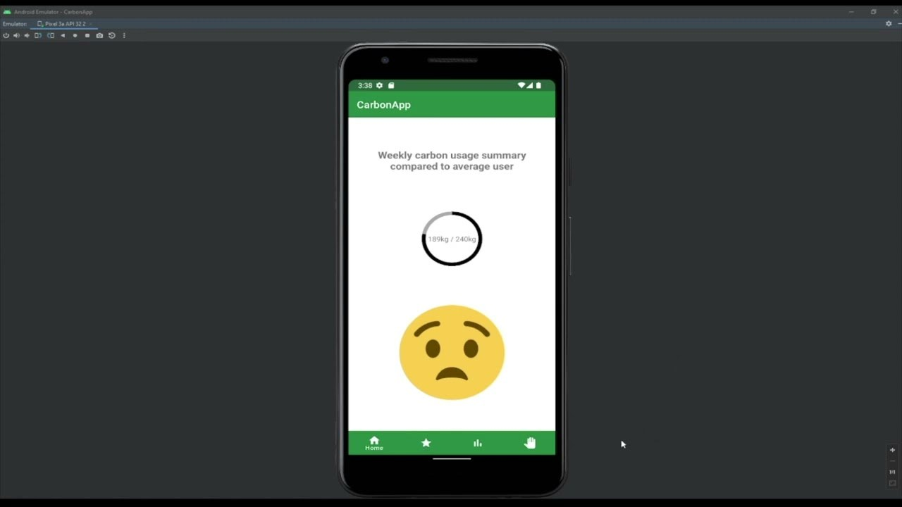
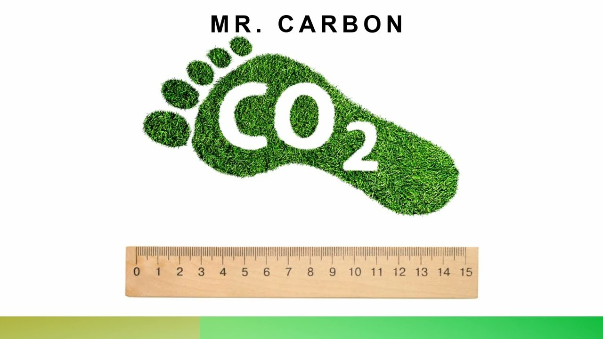
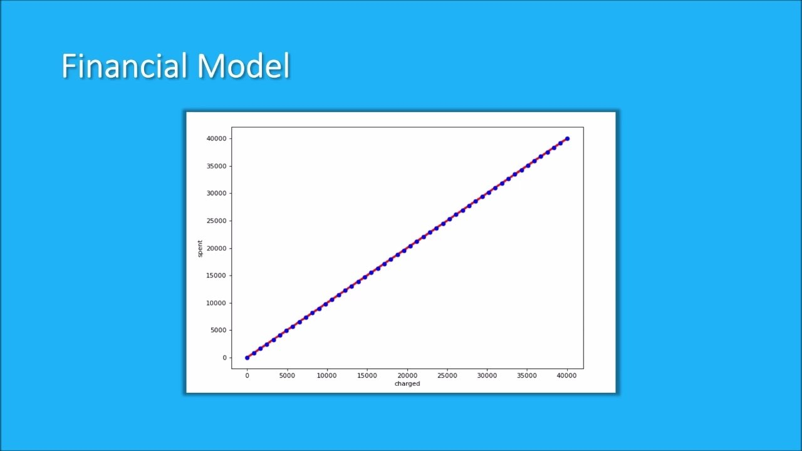
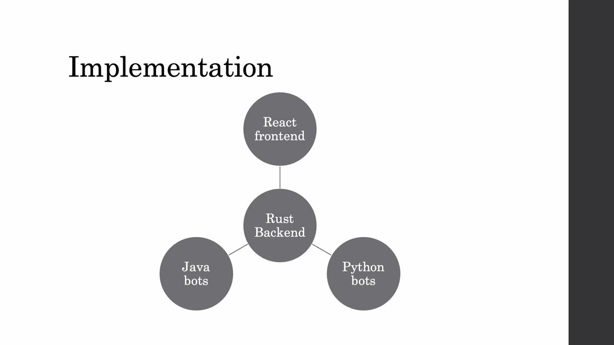
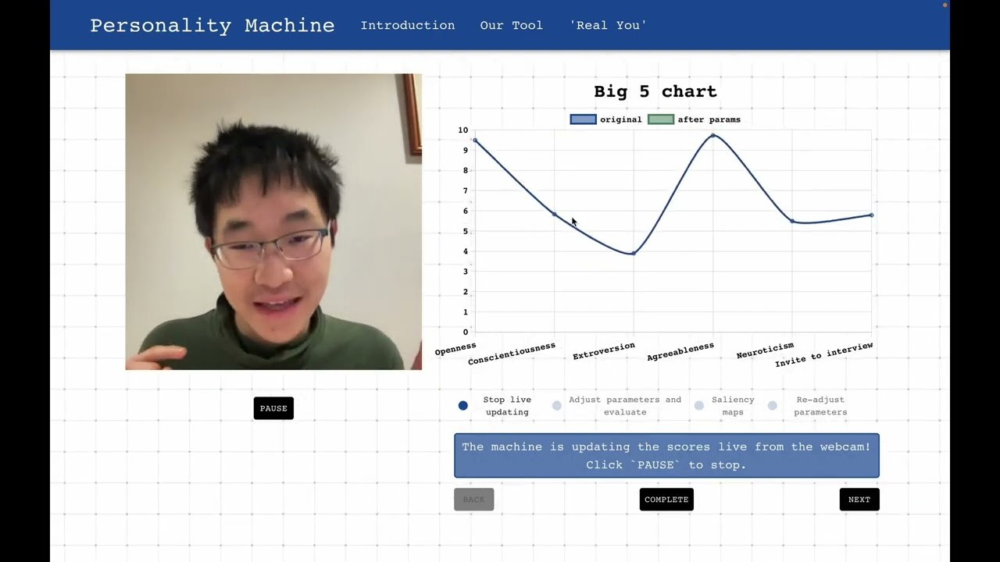
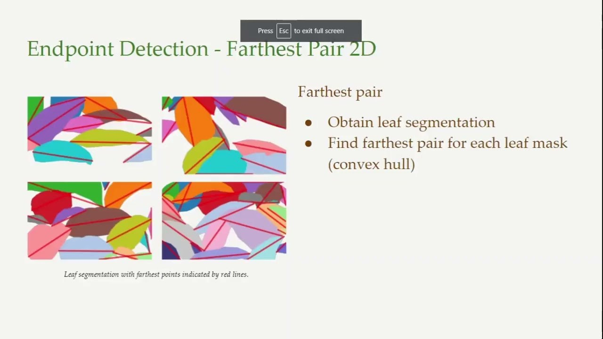
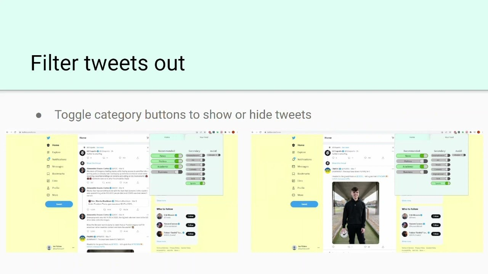
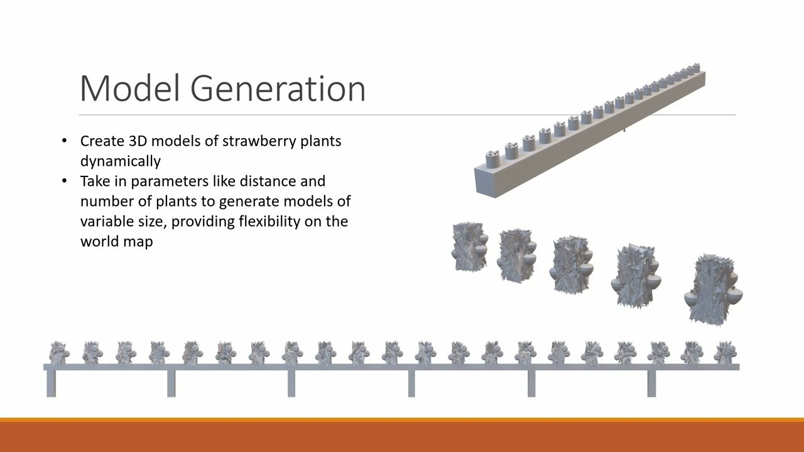
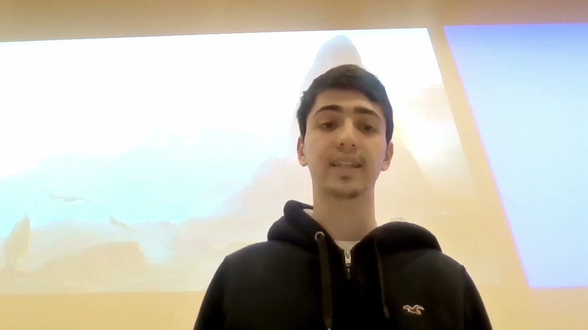
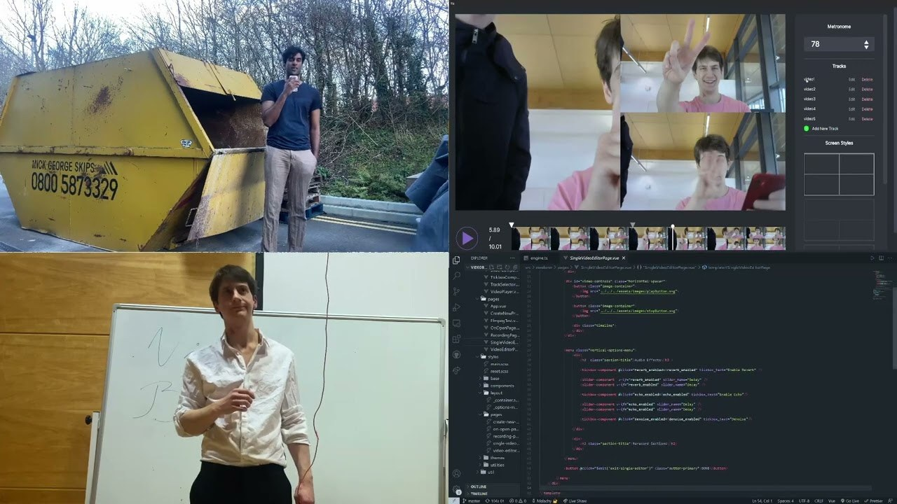

# 2022

Complete list of design briefs to be advertised to students for 2022
group design projects.

### Carbon Accounting

 
Client: [Matthew Postgate](Matthew_Postgate), Informeta Ltd
<matthew.postgate@infometa.com>

Today’s personal bank accounts and banking apps all work by counting
money, a simple technology that was created centuries ago as a social
consensus to support trade. In the future, we are going to need a carbon
economy that realistically prices everything in relation to the actual
costs for the planet. Your task is to create a prototype of a new
banking system, including personal savings and payment apps, where every
transaction is based on the verified carbon cost of products and
services. Consensus on carbon costs should allow for initial estimated
quotes the first time a particular transaction is made, with better
calibrated scientific evidence funded by arbitrage to increase eventual
accuracy for integrity of the whole system.

### Conservation Evidence Synthesis
 
Client: Thomas White, [BioRISC](BioRISC) <tbw27@cam.ac.uk>

Many published descriptions of conservation projects contain information
about the actions that were taken, what they cost, and how effective the
results were. However, it’s impossible for one person to find and digest
the corresponding pieces of evidence when the relevant publications can
be so varied in format and length. Your task is to use natural language
processing methods to assemble the most important quantitative and
qualitative data, and generate short and approachable texts
communicating the essentials of each publication.

### Creative Community
 
Client: Matthew Johnson, [Frontier](Frontier)
<mjohnson@frontier.co.uk>

Children today struggle with mental health challenges, and it seems from
research that the social dynamics of platforms like Instagram do not
help. There are alternative approaches to building community, for
example the way that TikTok encourages users to build on each other’s
contributions with memes, challenges and reaction videos rather than
just accumulate likes (see
<https://www.eugenewei.com/blog/2021/2/15/american-idle>). Your task is
to create a mobile app that develops community through creative
quotation and remixing, with feedback mechanisms that emphasise quality
rather than quantity. TikTok already exists, so this app will be focused
on phone-based drawing, painting and image remixing, rather than video.

### Empathetic Chatbot
 
Client: Lee Wilson, [Centre for Policy
Futures](Centre_for_Policy_Futures) <l.wilson7@uq.edu.au>

Chatbot dialog builders can be used to create systems that are very good
at dispensing accurate information such as medical advice, following a
configurable decision tree, but the output text needs to be standardised
and impersonal. Language model-based text generators on the other hand,
produce text that is grammatical and possibly entertaining but often
factually wrong. Your task is to integrate the two into a demonstrator
for the World Health Organisation that can be configured by public
health clinicians to give accurate advice when needed on problems like
Covid infection, and can also stimulate mental health with original
creative responses - but only when the question from the patient makes
it safe to do so!

### Exhibition Inference
 
Client: Neta Spiro, [Royal College of
Music](Royal_College_of_Music) <neta.spiro@rcm.ac.uk>

The Royal College of Music Museum has one of the richest collections of
music-related objects in the UK and Europe, spanning over 500 years of
musical activity. A new layout has just been created, and the museum
needs to learn how visitors respond to it in order to refine the design
in future. We suggest tracking (with permission) visitors who may use QR
codes to access media or links from a specific exhibition case. Your
task is to combine time-stamp records of QR access with dead reckoning
from a phone's step counter, glimpses of GPS signal through the museum
windows, prior knowledge of valid walking paths around the museum
display, and any other sources of data you can find, to get the best
estimate of how visitors travel around the museum, as well as which
exhibits they pause at and in which order.

### Flyathlon
 
Client: Adham Ashton-Butt, [British Trust for
Ornithology](British_Trust_for_Ornithology)
<adham.ashton-butt@bto.org>

Major sporting events such as marathons and triathlons often raise funds
and awareness for good causes including conservation. This project is an
opportunity to design a new global sport where human challenges are
measured against the challenges faced by wildlife such as migrating wild
birds. You will use the Strava API to capture records of human
performance, and monitoring data from bird migration (available from
your client) to represent wildlife. You will need to define the rules
for this new hybrid sport, including secure and fair algorithms to
determine the competition results that might combine running, cycling
and flying stages. Will humans compete against birds, or be combined in
hybrid teams? Your technical platform should also include social media
and live stream support to that can be scaled to global public
participation such as refereeing, commentary, fan clubs or cash
sponsorship.

### Global Ground Truth
 
Client: Alec Christie (ICCCAD liaison) <apc58@cam.ac.uk>

Local people in rural areas have valuable knowledge about climate change
effects and adaptation, but it is not straightforward to integrate their
observations into scientific evidence and policy frameworks. Your task
is to create a trusted infrastructure that integrates reports from local
people (including photos and voice recordings to be translated as
necessary) into a secure evidence blockchain. The client tools must run
on low-end android phones, and be accessible to people with low
literacy. Processes for authentication and standardisation should
respect traditional authority, cultures and rights of indigenous people,
and expert advice will be available from the International Centre for
Climate Change and Development (ICCCAD) in Dhaka.

### Green Maps

 
Client: Pasquale Giovenale, [IMC](IMC)
<pasquale.giovenale@imc.com>

In an effort to tackle climate change, we would like to reduce our
carbon footprint. Therefore, we want to offer people insights into the
carbon footprints of various transit options. Your task is to develop a
system which finds routes using various transport types (cycling, car,
train, plane) and computes the costs, travel time and carbon footprints
of them. In the end, the user can then make an informed decision on what
mode of transport to take.

### Household Payment Pool

 
Client: Richard Watts, [BigPay](BigPay)
<richard@bigpayme.com> or James Hinshelwood

Routine financial responsibilities can be more pleasant if a small
amount of chance is involved, for example UK Premium Bonds, which
distribute interest as monthly prizes with an average rate of return
comparable to other government-backed investments. This project aims to
create a personal finance game in which housemates (or larger groups)
can exchange transactions. When you spend money, the transaction will be
charged to some random member(s) of the group - possibly split. An
important constraint is that you should never be charged more money than
you would otherwise have spent in a given period (tunable by either you
or the group). Design suitable rules and build a UI and transaction
recording system that allows people to play this game.

### International Treasury Service
 
Client: Richard Watts, [BigPay](BigPay)
<richard@bigpayme.com> or James Hinshelwood

Many companies have to work across currencies. BigPay operates in both
Malaysia and Singapore, and has to use an external service provider to
move money between the two. It would be more efficient to do this
themselves, managing reserves of both currencies (MYR and SGD), setting
an exchange rate, and executing and settling transfers taking at least a
day to complete. Your job is to design a software system capable of
managing and visualising these reserves. It should take a feed of the
buy and sell rates available from partners at various distances in time
(1 day, 7 day, 30 day) and export an API allowing users to give a target
currency and amount and receive a price (and then confirm the transfer).
As far as possible, the system should achieve optimal revenue. You will
need to write a simulator for exchange rates and for customer behaviour.

### Migration Simulation
 
Client: Steffen Oppel, [RSPB](RSPB)
<Steffen.Oppel@rspb.org.uk>

The Yelkouan shearwater is a bird that migrates through the Bosphorus to
reach the Mediterranean, but nobody knows how many there are. Your
client has video of the migration as seen from different distances and
angles. Unfortunately computer vision algorithms can’t be trained
without ground truth count of how many birds are there. You will create
a CGI simulator of the flocking birds, including realistic atmosphere
and viewing conditions, to generate simulated video with known ground
truth bird numbers. The final stage is to train a machine learning
system using your simulation to automatically retrieve the number of
simulated birds, and then test it on a real migration video to yield the
number of real birds.

### Mobilising the University
 
Client: Abraham Martin, [University Information
Services](University_Information_Services)
<amc203@cam.ac.uk>

Many University systems used by Cambridge students can be extended using
the new UIS API Gateway service, including location and access
facilities that are currently delivered via the University Card, but
which could in future be accessed via NFC authentication from the
student’s phone. The goal of this project is to create a new student
arrival experience, delivered via a phone app that integrates their
official physical access to Cambridge with administrative onboarding and
the online knowledge resources of the University.

### Online Programming Game

 
Client: Lex van der Stoep, [IMC](IMC)
<lex.vanderstoep@imc.com>

To teach beginning programmers problem solving and coding skills, we
would like you to build an online programming game platform. The idea is
for players to program bots which play a multi-player move-based game
(e.g. Battleships, Snake, Pacman). The platform should expose a simple
API through which the players can retrieve the current state of the
game, and publish their next move. It should then display these moves
into a visual representation of the game, allowing players to see how
their bots are doing.

### Personal Ambiguator

 
Client: Eleanor Drage, [Centre for Gender
Studies](Centre_for_Gender_Studies) <ed575@cam.ac.uk>

Many areas of life such as housing, health, education and employment are
subject to gender, racial and other biases that can be detected with
machine learning classification systems. Your task is to identify
potential bias in personal documents such as a CV, health record or
university application, and then to use a generative neural network
approach to tweak these documents (perhaps by adjusting text or
selectively removing information) so that they cannot clearly be
classified. The algorithm should be packaged in an interactive tool that
allows people to write ambiguated personal documents, and also
highlights and educates them about the sources of bias.

### Reading the Leaves

 
Client: Julian Godding, [Gardin](Gardin)
<j.godding@gardin.co.uk>

Plant leaves are anatomically complex but can be structured in ways to
make a digital model of the plant. In this project your goal will be to
use time-lapse photography to render a 3D model of plants growing in a
vertical farm in real-time; mapping a grid-search of chlorophyll
fluorescence measurements and displaying phenotype properties such as
leaf area and weight, calibrated against ground truth measurements.

### SMART Climate Goals
 
Client: Vedantha Kumar, Children's Investment Fund Foundation
<vkumar@ciff.org>

The COP26 conference has highlighted the need for decisive action on
climate change, both for governments and companies around the world. But
which of these are just talking, and which are setting concrete goals?
Goals can be evaluated using the SMART framework
(https://www.atlassian.com/blog/productivity/how-to-write-smart-goals).
The SMART acronym stands for Specific, Measurable, Achievable, Relevant
and Time-Bound. Create a system which can be used to analyse reports and
statements, and identify climate change-related "goals" within them, and
then evaluate these goals against the SMART criteria.

### Smart Bins
 
Client: t.b.c. [IMC](IMC)

To help people become more sustainable, we would like to give them
insights in their waste production. Your task is to develop a smart
waste management system that keeps track of how you are disposing your
waste. The idea being to make it more transparent so you can highlight
areas to improve. The container would automatically weigh waste, and
provide the user with insights through an app, so they see how their
waste metrics compares to global and regional averages. A further
feature could be to use image recognition to classify waste types, or to
allow users to compete with friends on sustainability.

### Social Media Wellbeing Filter

 
Client: Victoria Doerfer, [Dovetailed](Dovetailed)
<victoria@dovetailed.io>

Social media is part of our everyday lives, but constant exposure can
have negative effects - to the point where people remove themselves
entirely from social networks. We want to make social media more
positive for people, with a plugin that checks in with the user each day
and can make suggestions or adjust feeds based on their mental state.
How much negativity can they can deal with? Did they already have a bad
day? Do they feel ready to see some bad news, but not too much? You
might want to take on large platforms like Facebook or Twitter, or
perhaps start with plugins or readers for a more specialist platform
like Reddit.

### Strawberry Fields

 
Client: Marc Jones, [Antobot](Antobot)
<marc.jones@antobot.ai>

Strawberry pickers currently spend a significant amount of time (approx.
20%) manually transporting trays to stations, generally at the end of
the field. Autonomous logistics robots provide the opportunity to
increase productivity by transporting the trays, thus reducing the
demand on labour. Your challenge is to create a simulation of a typical
harvesting scenario in ROS Gazebo and develop an optimised algorithm for
efficient multiple robots path planning. Use this to recommend the
minimum number of robots required (e.g. scheduling / logic) – too many
robots will be complex and potentially too expensive, too few will
create delays for the pickers and reduce efficiency. Based on the
simulation results, you should identify required sensor and actuator
technologies in order for the robot to optimally interact with human
staff.

### The Automatic Accountant

 
Client: Mark Parsons, [Cambridge
Enterprise](Cambridge_Enterprise)
<Mark.Parsons@enterprise.cam.ac.uk>

The Automatic Statistician is a system created by Zoubin Ghahramani and
colleagues that looks for interesting patterns in data sets (by fitting
Gaussian process models), and then automatically generates a research
paper, including charts and natural language texts, describing the
patterns that it finds. Financial accounting data is relatively
constrained in its format, so it should be more straightforward to
create an AI system that automatically generates professional-looking
reports on a company’s performance, including capabilities for audit and
compliance checking that work by recognising statistical anomalies. You
will need to familiarise yourself with the research from
www.automaticstatistician.com, and work with your client to design an
original accounting application.

### Urban Stories

 
Client: David Russell, [The Fusion Works](The_Fusion_Works)
<david@thefusionworks.com>

The what3words service has become very successful, with its pitch that
three random words can identify any location on the planet. If you’ve
used it, you may have noticed that the random words are often strangely
relevant to the Cambridge locations being specified - if not for one
particular cell, then quite likely for the cell next to it. Your task is
to use a combination of natural language processing and path
optimisation methods to turn these into engaging stories, starting from
the creative seed of places you have visited, or perhaps would like to
visit.

### Video Bones

 
Client: Phil Cambridge <p@phil-c.com>

The trombone is a beautiful instrument, at its best when viewed from
multiple sides and heard from a distance, as in this video by Phil
Cambridge: <https://www.youtube.com/watch?v=dAM2qJ0m7Oc>. Like Phil, we
could all do with better tools for composing and publishing multitrack
audio and video streams of the kind that became familiar during
lockdown. Your task is to create a music-specific multitrack video
editor with everything a brass player needs, perhaps incorporating solo
and chorus, virtual camera pan and rotate of instruments and chamber
groups, hip hop loops and video stutters, or other effects suited to
your favourite music genres.

### Wiki Editor-Editor

 
Client: George Gospodinov, [Amazon](Amazon)
<gkgospo@amazon.co.uk>

Wikipedia editors are among the few remaining public servants who we can
rely on to distinguish between truth and lies. Many of the first
generation of editors are still around, but the future of human
knowledge might depend on newcomers acquiring better understanding of
how to do this effectively. Your task is to analyse what makes a
Wikipedia editor effective, using the WikiData corpus to identify which
patterns of editing deal with controversies, result in lasting
consensus, and so on. Using the results of this analysis, create an
automated interactive training guide for new editors, giving them
feedback on their own patterns of response, and helping them identify
how they might deal with different cases.

### Youth-led Future
 
Client: Oliver Williams, [Curriculum for
Life](Curriculum_for_Life) <oli@curriculumforlife.com>

Most young people (in wealthy countries) now have their education
controlled via virtual learning environments. But preparation for the
future will involve challenging the curriculum, not just accepting the
status quo. Your task is to create an alternative mobile browser that
school students can use to construct a customised view which
collaboratively annotates, critiques, adjusts and (re)evaluates the
front end facilities of their school’s VLE. Just like the school strikes
for climate, it shouldn’t be necessary to wait for permission, when
creating youth-led alternatives to established skills and
qualifications. This can’t be just another social media platform -
Facebook is clearly the wrong model!

## Project videos not yet matched to a brief

The 2022 playlist titles its entries only "Group A" to "Group T", with no
project name and no description, so these eight could not be tied to a brief with
confidence. They are listed here rather than guessed at.

| Group | Video | Likely among briefs |
| --- | --- | --- |
| B | [Watch on YouTube](https://www.youtube.com/watch?v=4aUa8HX7exg) | Conservation Evidence Synthesis, Creative Community, Empathetic Chatbot, Exhibition Inference, Flyathlon, Global Ground Truth |
| C | [Watch on YouTube](https://www.youtube.com/watch?v=S5z7erKmkfc) | Conservation Evidence Synthesis, Creative Community, Empathetic Chatbot, Exhibition Inference, Flyathlon, Global Ground Truth |
| D | [Watch on YouTube](https://www.youtube.com/watch?v=0Ya1Fhilx2s) | Conservation Evidence Synthesis, Creative Community, Empathetic Chatbot, Exhibition Inference, Flyathlon, Global Ground Truth |
| E | [Watch on YouTube](https://www.youtube.com/watch?v=pkvllGDjxUo) | Conservation Evidence Synthesis, Creative Community, Empathetic Chatbot, Exhibition Inference, Flyathlon, Global Ground Truth |
| F | [Watch on YouTube](https://www.youtube.com/watch?v=kJ1RCX--SAA) | Conservation Evidence Synthesis, Creative Community, Empathetic Chatbot, Exhibition Inference, Flyathlon, Global Ground Truth |
| I | [Watch on YouTube](https://www.youtube.com/watch?v=aC5dk0PWC1Y) | International Treasury Service, Migration Simulation, Mobilising the University |
| J | [Watch on YouTube](https://www.youtube.com/watch?v=NvbimkORsZU) | International Treasury Service, Migration Simulation, Mobilising the University |
| N | [Watch on YouTube](https://www.youtube.com/watch?v=Xr42VOpSqP4) | SMART Climate Goals, Smart Bins |
