# 2024

Complete list of design briefs to be advertised to students for 2024
group design projects.

### Acoustic Land Management

<a class="brief-video" href="https://www.youtube.com/watch?v=zeCRJYL3suw"
   title="Watch the Group Alpha project video on YouTube">
  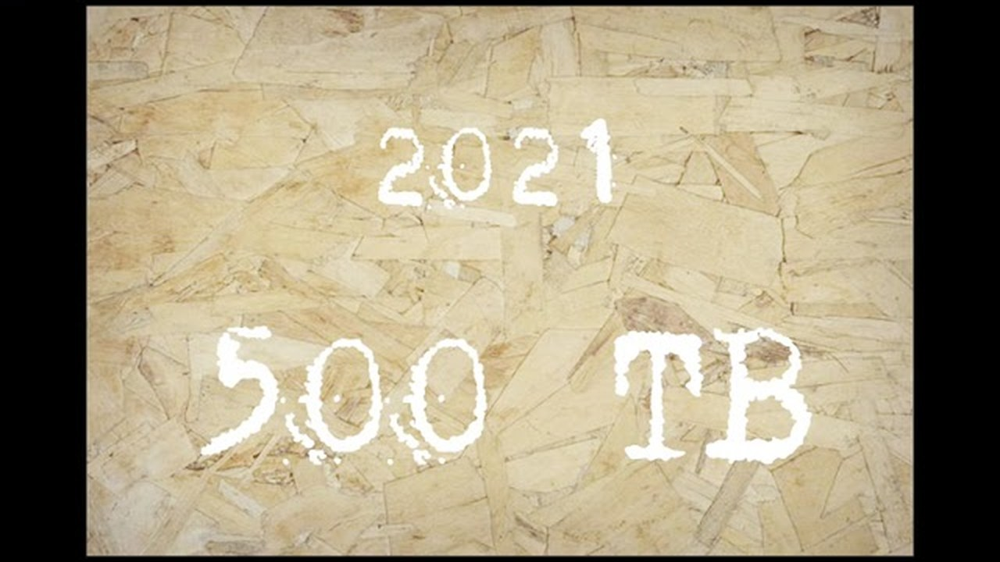
</a>
 
Client: Adham Ashton-Butt, BTO <adham.ashton-butt@bto.org>

Land managers are often responsible for restoration projects, in which
they make changes expected to benefit wildlife over time. One very
useful source of evidence is acoustic data recordings. This project is
intended to create an interactive application that can be used by land
managers to visualise, make decisions, monitor, and evaluate their
interventions, based on bioacoustic survey data processed through the
BTO acoustic pipeline and enhanced with machine learning methods.

### Braille Predictive Text

<a class="brief-video" href="https://www.youtube.com/watch?v=iMYDpjEHDmY"
   title="Watch the Group Bravo project video on YouTube">
  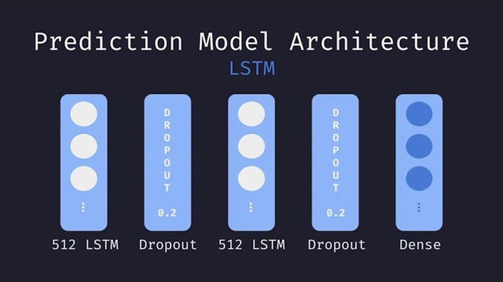
</a>
 
Client: Gregory Hargraves, Paige Braille <greg@paigebraille.com>

David MacKay’s Dasher was a radical predictive text system where a
machine learning language model helped users with disabilities by
guiding them to zoom in to more likely possible texts. That’s no use for
people with a vision impairment, who can’t see the guidance or easily
operate animated graphical interfaces. This is an opportunity to work
with a team who have recently augmented the classic mechanical Braille
typewriter with internet connectivity. Your prediction model will help
users to learn and master Braille, by offering appropriate spoken
suggestions on what word they might be typing and (if needed) remind
them which keys they might need to press next. All this will have to be
designed in a way that is helpful, motivational and accessible, not an
additional obstacle to learning Braille!

### Climate Foresight

<a class="brief-video" href="https://www.youtube.com/watch?v=HBgiUDarWAs"
   title="Watch the Group Charlie project video on YouTube">
  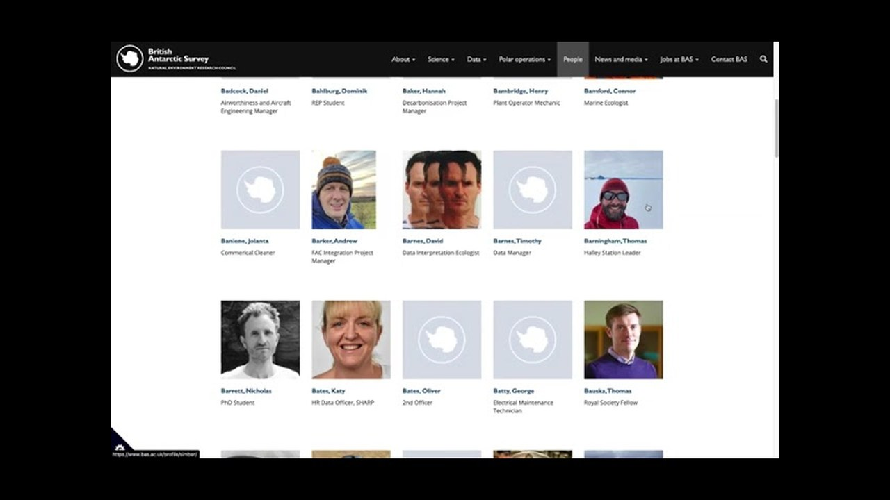
</a>
 
Client: William Jones, Embecosm <william.jones@embecosm.com>

Dynamic Causal Modeling is a Bayesian statistical technique for reverse
engineering time series data. One of the ongoing challenges in applying
such statistical models is how to visualise the multiverse of possible
outcomes that the algorithm derives. Your goal is to create an
evidence-based visualisation of possible climate futures that allows
users to interrogate and compare projections from a complete simplified
carbon-climate model within the Dynamic Causal Modeling framework.

### Component Quest

<a class="brief-video" href="https://www.youtube.com/watch?v=WoqHUbWiZuQ"
   title="Watch the Group Delta project video on YouTube">
  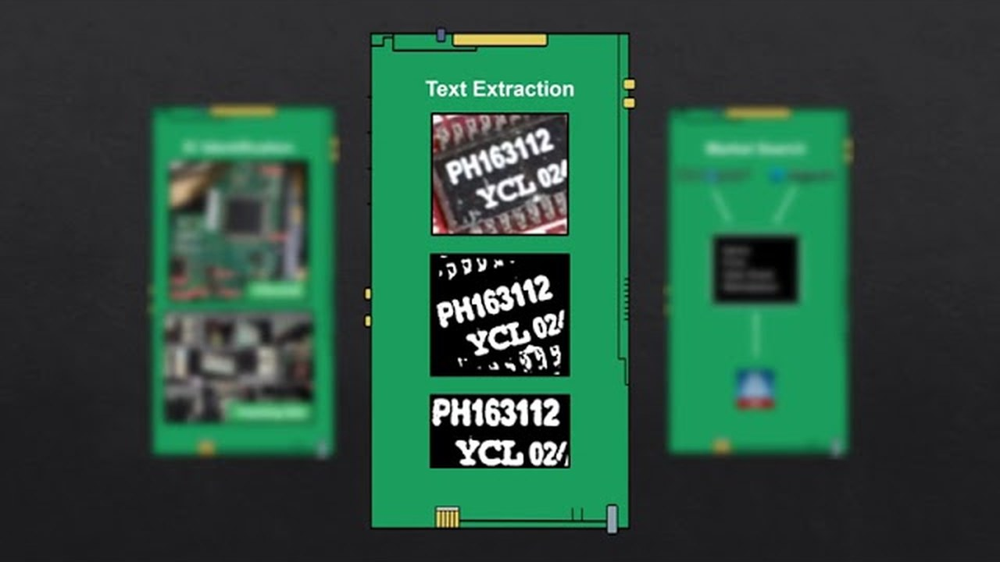
</a>
 
Client: Stephen Devlin, Sensors CDT <sd2030@cam.ac.uk>

The electronics industry faces chip shortages, rising costs, and
increasing e-waste. This creates demand for secondhand components, but
it can be difficult to identify and value them. Develop a smartphone app
that uses AI to identify and value electronic components (usually still
mounted on PCBs) using the phone camera. The app should handle a wide
range of components, provide current market value, and link users to a
marketplace to buy and sell them.

### Copilot for Business

<a class="brief-video" href="https://www.youtube.com/watch?v=utCyQ6fnbXs"
   title="Watch the Group Echo project video on YouTube">
  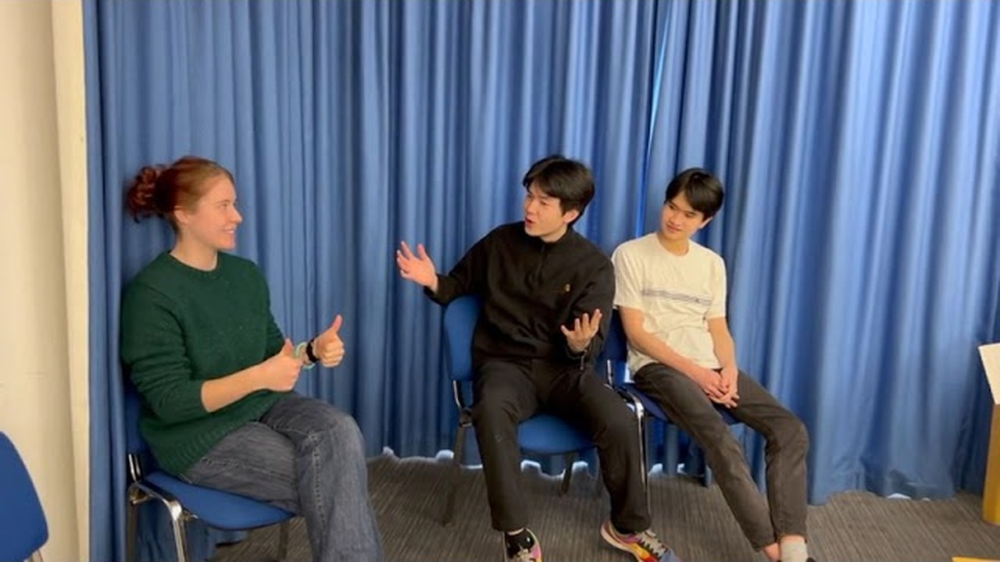
</a>
 
Client: Jason Mashinchi, Cambridge Kinetics
<jason.mash@cambridgekinetics.com>

We’re all familiar with the code generation capabilities of ChatGPT and
GitHub Copilot. That’s fine for experienced programmers, but how could
an AI coding tool support people who have never written a line of code?
Your goal is to create a user friendly natural language interface that
not only generates code for extracting and visualising data from an
arbitrary business database, but helps non-programmer users to
understand how that code works, recognising and correcting bugs or
hallucinations in the generated code.

### Creative Writing Coach

<a class="brief-video" href="https://www.youtube.com/watch?v=_BM6zlHrIdY"
   title="Watch the Group Foxtrot project video on YouTube">
  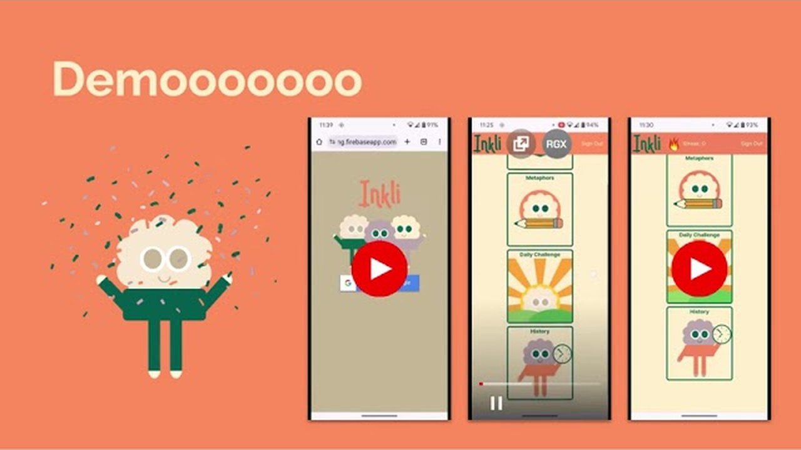
</a>
 
Client: Rachel Thorley, Inkli <rachelthorley@gmail.com>

Will human authors be replaced by AI? Language models can convincingly
generate human-sounding text and automate many writing tasks, even
contributing to novels! Instead, could they be harnessed to make us all
more creative? The goal of this project is to create an app in the style
of Duolingo. This app will use bite-sized, gamified lessons to help
students write more creatively, with poetic imagery, dramatic tension,
and vivid characterisation. Experiments show that a standard LLM (with
carefully designed prompts) can provide useful feedback. Your app needs
to engage and motivate students to become more fluent and confident
creative writers.

### Disability Bias Explorer
 
Client: Cecily Morrison, Microsoft Research Cambridge
<cecilym@microsoft.com>

Recent work led by a team at ethical AI initiative Hugging Face
(arXiv:2303.11408) demonstrated a tool that could be used to
interactively investigate some of the race and gender biases that have
become encoded in major text to image generation systems. Your task is
to create a similar tool that could be used to demonstrate image
generation biases relevant to visual disabilities. You may also need to
consider how this tool can be made accessible to users who have visual
disabilities themselves.

### DoS D-Stress

<a class="brief-video" href="https://www.youtube.com/watch?v=66jd92Y-4lU"
   title="Watch the Group Golf project video on YouTube">
  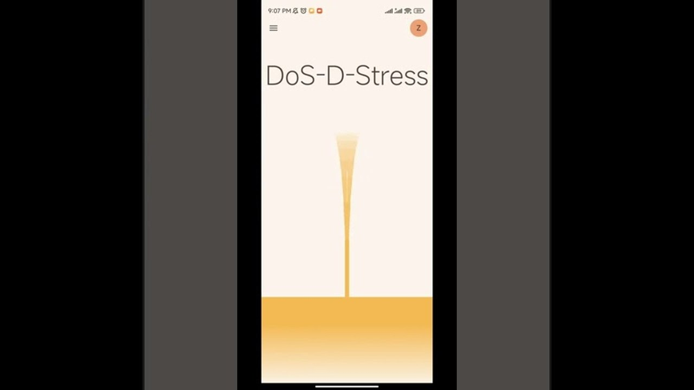
</a>
 
Client: Simon Fothergill, Cam AI <simon@cam-ai.co.uk>

The very first AI chatbot was the psychotherapist Eliza. For young
people today, mental health is more challenging than ever, but we aren’t
using LLM technology in ways that reduce stress. Your goal is to create
a de-stressing experience, potentially including responsive sound and
imagery alongside short generated text exchanges that respond to what is
stressing you. A fully automated chain should direct stressful content
(e.g. an email from your DoS) directly into the system so that you can
be properly de-stressed before you even read it.

### Engaging Everyone
 
Client: Rachel Gardner, Communications Manager

Many public events and services aim to include young people, with
meaningful attention to their specific views and needs. Our own outreach
activities, such as the huge Cambridge Festival (next taking place on
16th March 2024) want to ensure that feedback from visiting families
includes all visitors, especially where “family” feedback might
otherwise only engage adults through traditional surveys. Your task is
to create a fun and engaging online tool that encourages people of all
ages to share their views, and is inclusive and motivational for the
young. If successful, we can deploy this at the Cambridge Festival as
soon as it is finished.

### Envisioning Nairobi

<a class="brief-video" href="https://www.youtube.com/watch?v=SILTlM-_8-s"
   title="Watch the Group Hotel project video on YouTube">
  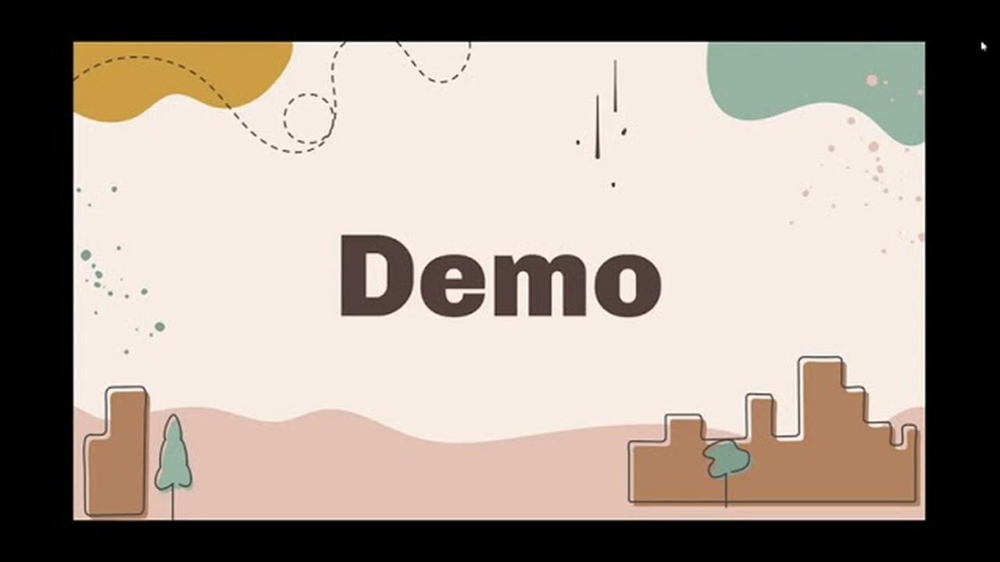
</a>
 
Client: Nkatha Gichuyia, Urban Re-engineering Taskforce
<lindankatha@gmail.com>

Large cities around the world are grappling with plans to accommodate
environmental, social and climate change. But there is a huge gulf
between the technical software of geographical information systems and
infrastructure planning on one hand, and the retail and entertainment
data that is promoted in consumer products like Google Maps. The city of
Nairobi is thinking ahead through visionary planned cities as Nairobi
Railway City, Tatu City, and the Konza Technopolis, that aim to present
models of how an environmentally sustainable and climate-resilient urban
area developments in a carbon-constrained environment can be delivered.
Your role is to prototype a new social mapping tool that could engage
members of the local population in these discussions, visualising data,
plans, priorities, and their personal implications.

### Heterodox Economic Modeller

<a class="brief-video" href="https://www.youtube.com/watch?v=ciWQAS3O990"
   title="Watch the Group India project video on YouTube">
  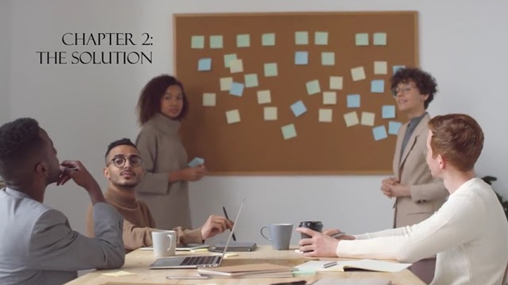
</a>
 
Christopher Newfield, Independent Social Research Foundation
<chris.newfield@isrf.org>

There is a long history of financial simulators that can be used to
model national economies, dating back to the water-powered “Phillips
machine” (we have one in Cambridge). Today’s economy is stuck in a rut,
because alternative economic theories are proposed by people whose
mathematical models are simply less well embedded than the legacy
implementations. Your task is to create a quick and dirty financial
simulator that could be used by heterodox economists to propose and
debate serious alternatives to outdated government and corporate
policies.

### Influencing Health

<a class="brief-video" href="https://www.youtube.com/watch?v=MohovpwfczQ"
   title="Watch the Group Juliet project video on YouTube">
  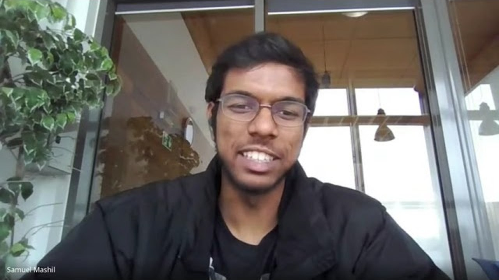
</a>
 
Client: Lee Wilson, Kavavar <lee.wilson@kavavar.com>

Many more people get their news from social media than TV, but much
national and international public health policy relies on public
broadcasting as the primary channel of communication. Your job is to
make a tool that helps reconnect local health emergencies and
interventions to local influencers who may be motivated to help. This
will involve using APIs from TikTok, Instagram etc, but mapping these
against local health statistics in a way that doctors and government
officials can see what is going on.

### Investment Provenance

<a class="brief-video" href="https://www.youtube.com/watch?v=XGS3q6_-u1A"
   title="Watch the Group Kilo project video on YouTube">
  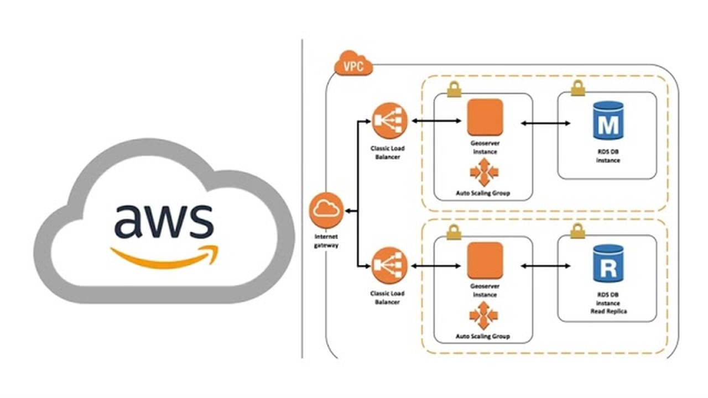
</a>
 
Client: David Friedman <daf39@cam.ac.uk>

There are many online forums that offer investment advice, but not much
of it is original. Your task is to create a tool for use by traders,
that annotates investment tips with a plausible history of where they
might have come from. Any correlation with historically objective
information, such as share price movements, may be a helpful source of
causal evidence. This project is likely to require some research into
text processing algorithms and statistics, as well as an intuitive front
end that helps users understand the "genetics" of specific investment
trends and memes.

### Memories Retold

<a class="brief-video" href="https://www.youtube.com/watch?v=YA7x6H_nR_g"
   title="Watch the Group Lima project video on YouTube">
  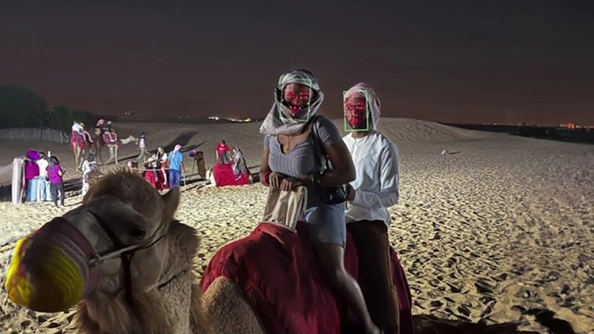
</a>
 
Client: Jonathan Sunderland, Ab Initio <JSunderland@ABINITIO.com>

Design and develop an application to help people with memory loss create
an oral history through interactive prompted storytelling. The
application should use AI to identify suggested talking points and ask
contextual questions to trigger the unlocking of long-term memories. The
application should accept images as input prompts, and use
speech-to-text conversion to capture the user's responses. Ethical
aspects should be considered, including who might use the application,
in which circumstances, and when.

### Optimising Music Notation

<a class="brief-video" href="https://www.youtube.com/watch?v=3ednRmrxElQ"
   title="Watch the Group Mike project video on YouTube">
  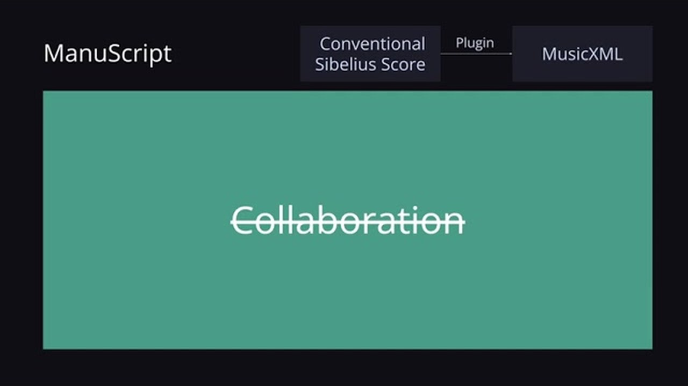
</a>
 
Client: Arild Stenberg, Score Designs Group <arildstenberg@gmail.com>

The LaTeX typesetting system can be used to render many alternative
styles of document from a master text specification. In contrast, music
typesetting systems like Sibelius make all music look much the same.
Your client has designed an optimised alternative style for music
notation that has been found to improve performance. Your task is to
define a specification language for these modifications, and implement a
rendering pipeline either as Sibelius extensions, or using an open
source music rendering back-end such as PMW (whose author, Philip Hazel,
will be available as a consultant to the project).

### P2P Social Network

<a class="brief-video" href="https://www.youtube.com/watch?v=MeQ116VSvRQ"
   title="Watch the Group November project video on YouTube">
  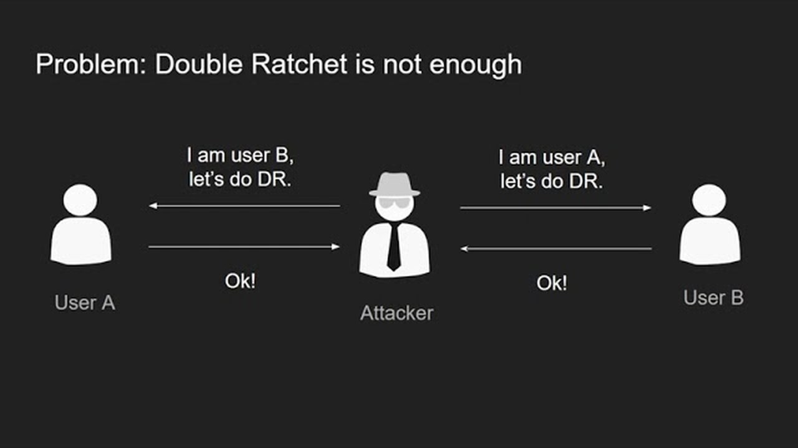
</a>
 
Client: Mick Vermeulen, IMC <mick.vermeulen@imc.com>

Social networks are a major part of our lives. The acquisition of
Twitter by Musk demonstrates how much influence one person can express
by changing the platform to his liking where users have no say in the
direction of the platform. Your assignment is to create a peer 2 peer
honest social network: a social network that has no central server that
anyone can join freely. You'll need to find or define a protocol that
allows users to communicate. Will you go truly peer2peer? Or would you
prefer a node-based approach where any server can join the network and
serve requests for users? It's important to ensure that users cannot
imitate each other. How do you prevent a hostile actor from joining the
networking and pretending to be someone else? There's no central
authentication server to verify this. Your solution should include a GUI
that allows for browsing user accounts. How would this work? How do you
fetch information about a user if there's no central server to provide
that, and should there be any restrictions?

### Ramping Up Sustainable Crops

<a class="brief-video" href="https://www.youtube.com/watch?v=H9kMkqaJJiM"
   title="Watch the Group Oscar project video on YouTube">
  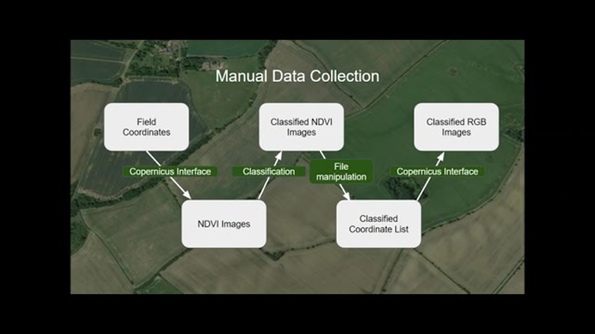
</a>
 
Charles Gentry, NIAB <charles.gentry@niab.com>

Arable crops in the countryside around Cambridge rely on soil nitrogen,
but many farming practices are wasteful of this critical resource,
potentially leading to other environmental risks. Your goal is to use
recent advances in satellite imagery and robot/drone application to
implement optimisation algorithms for the Ramp Calibration Strip method.
Real data can be used in to construct realistic field simulations, but
there may also be an opportunity to engage with trial tests in an
experimental field north of Cambridge.

### Real-pedia

<a class="brief-video" href="https://www.youtube.com/watch?v=1R5uGTQqcqU"
   title="Watch the Group Papa project video on YouTube">
  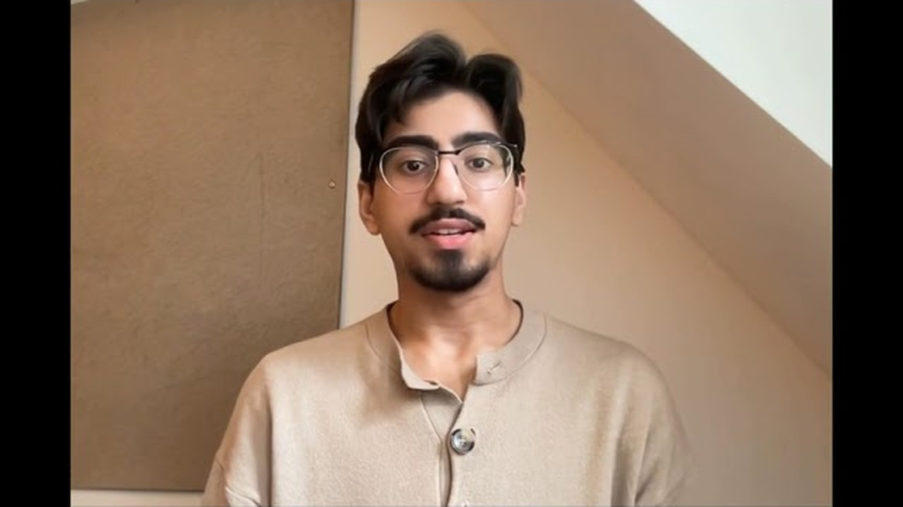
</a>
 
Client: Sandi Toksvig, Mappa Mundi project

The training data for AI large language models mixes up Wikipedia
articles with random text from social media trolls and commercial
sponsors. Many voices are excluded, from the girls not being educated in
Afghanistan, to the women who teach their own families all over the
world. Your goal is to make an alternative wiki architecture, where the
benchmark of authority is not who has the most money or followers, but
the best reflection of those voices. You’ll need to think about what
motivates women to spend their time this way, what kind of devices they
have access to, and what makes knowledge reliable. Your prototype might
be a small start, but the AI of the future depends on a better way of
understanding what is meaningful, and Wikipedia founder Jimmy Wales
should be available to discuss this with you.

### Supply Chain Resilience

<a class="brief-video" href="https://www.youtube.com/watch?v=MdaU6Emyop4"
   title="Watch the Group Quebec project video on YouTube">
  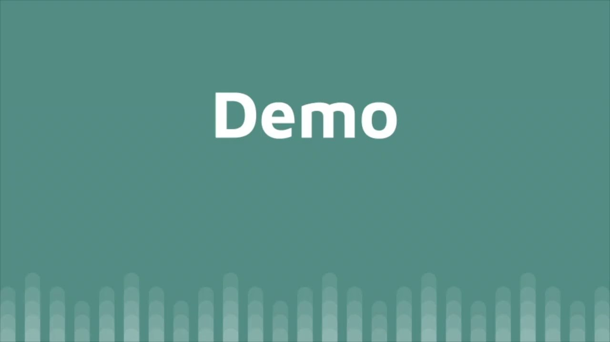
</a>
 
Client: Murad Abdulla, IMC <murad.abdulla@imc.com>

Events such as the Covid pandemic and the Ukraine-Russia war highlight
inefficiencies in global supply chains, affecting our everyday lives
through energy prices, inflation, cost-of-living, unemployment and
housing. This project will use publicly available datasets and APIs to
build a comprehensive map investigating supply chain choices such as
semiconductors for tech via China to the West, oil exports, agricultural
product shipments etc. You will create metrics for supply chain
efficiency and resilience, ranging from route stability to sensitivity
to natural disasters. This visualisation should offer opportunities to
optimise routes for delivery of different industrial products,
contrasting and comparing CO2 emissions, cost, reliability, and
robustness through diversity of supply options. It will be important to
ensure that data is not biased, and that features are explainable, to
support public accountability for decision makers.

### Talking Music

<a class="brief-video" href="https://www.youtube.com/watch?v=9PAk5EsAqmg"
   title="Watch the Group Romeo project video on YouTube">
  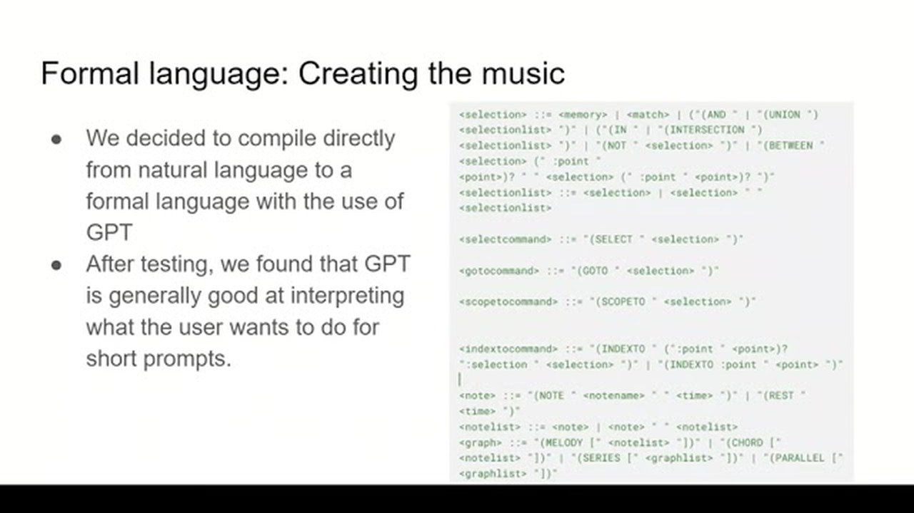
</a>
 
Client: Cecily Morrison, Microsoft Research

People with different sensory capabilities or diverse neural styles
sometimes find it easier to communicate via a musical instrument or a
piano keyboard than with the screen and keyboard of a laptop. The goal
of this project is to make an alternative kind of music editor that
works with text and sound as the elements, rather than working with
music notation on the computer screen. The open source synthesiser
SuperCollider generates professional quality sound, but you would
replace the sclang programming language with a natural language
interactive text system that could be driven from an assistive keyboard
or screen reader.

### Taste: Movies x Books x Music

<a class="brief-video" href="https://www.youtube.com/watch?v=6JFgs55ZUVI"
   title="Watch the Group Sierra project video on YouTube">
  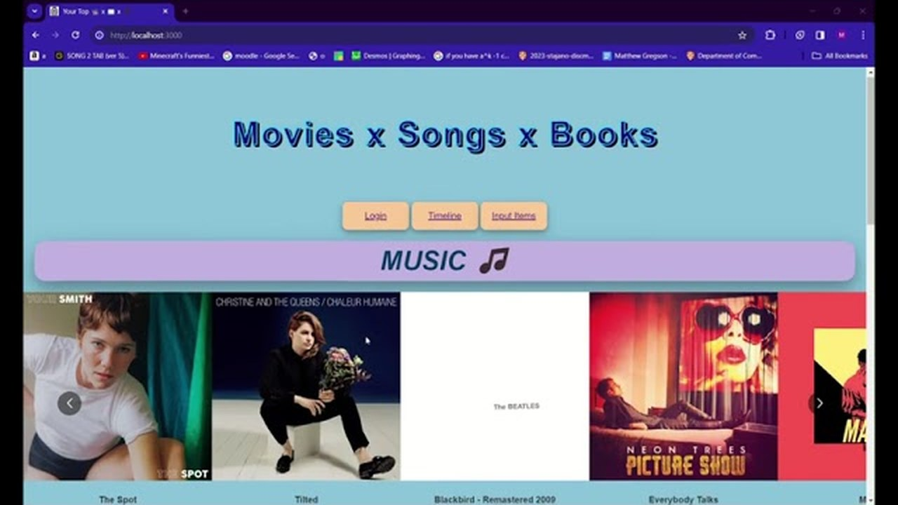
</a>
 
Client: Hrvoje Abramović, IMC <Hrvoje.Abramovic@imc.com>

There are many music, movie and book recommendation systems online, but
each focuses on a single medium. The goal of this project is to build a
web application which, when given a movie or a book, would present a
cluster of books, movies and songs that are related to it by often being
mentioned online together. It would be cool to see how clusters of
“tastes” form and how books, movies and music from the same artistic
movements naturally pop up together. A timeline could also give an idea
of the art history context, for example the movie Easy Rider might
relate to movies, books and songs popular with the hippy movement.

### Testing for Humans

<a class="brief-video" href="https://www.youtube.com/watch?v=MWgyIAPwXNc"
   title="Watch the Group Tango project video on YouTube">
  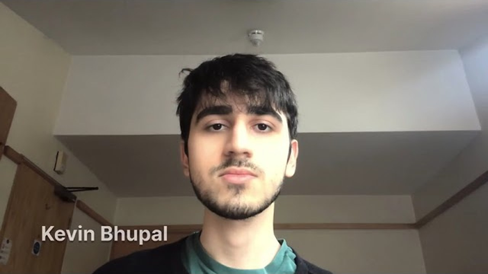
</a>
 
Client: Bhasi Nair, Equitech Futures <bhasi@equitechfutures.com>

Many companies rely on online programming aptitude tests to select
potential employees. Unfortunately, applicants can often fool the test
by finding answers online, or even generating a response automatically
using an AI chatbot. Your task is to create an authoring and
administration tool for aptitude question banks that automatically
benchmarks them against such strategies, helping the question author to
fine-tune them in a way that will guarantee human responses.

### Visiting the Forest Stream

<a class="brief-video" href="https://www.youtube.com/watch?v=c1xjgpdFlbU"
   title="Watch the Group Uniform project video on YouTube">
  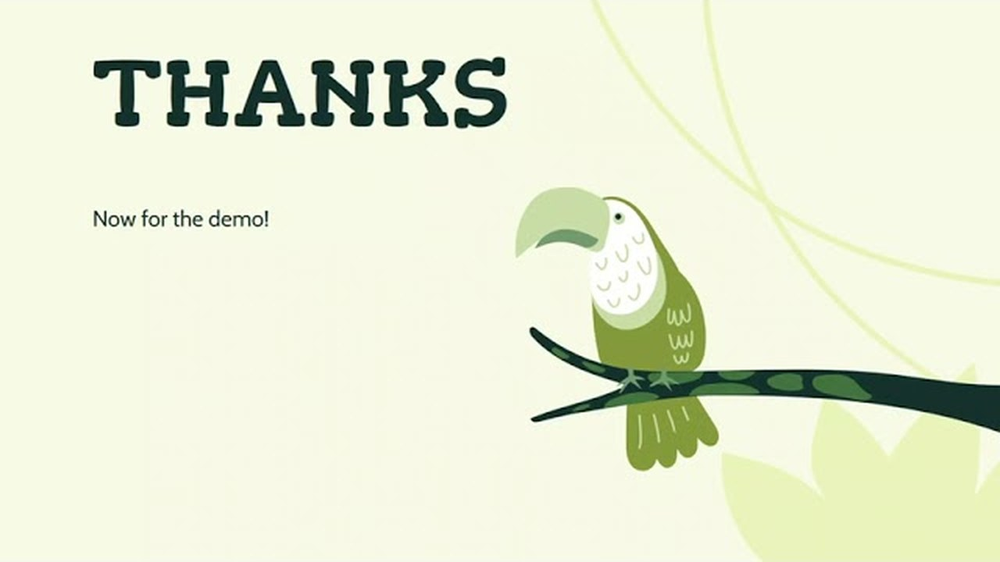
</a>
 
Client: Ana Cuza, ClimateInColour <anacuza@umich.edu>

There are many Spotify playlists featuring the sound of nature, but it's
hard to visit the places those sounds were recorded, or meet the people
that live there. This project is an environmental update on music
artists who make more money from concert visits and merchandise than
they do from streaming licenses. Your client has been working with a
forest community in Ghana, where the environmental soundscape doesn't
bring any revenue to the village. The goal is to create a geolocated
mobile app and business model, connecting distinctive sounds to new
revenues from ecotourism.

### Wearable Sleep Coach

<a class="brief-video" href="https://www.youtube.com/watch?v=9mde9hwSMrw"
   title="Watch the Group Victor project video on YouTube">
  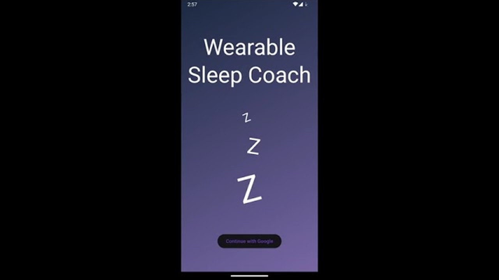
</a>
 
Client: Alex Venetidis, Terra <alex@tryterra.co>

Terra API unlocks health and fitness data from diverse sources,
including popular wearables and fitness apps like Fitbit, Apple Watch,
Oura, and 70+ others. Your challenge is to leverage the Terra API to
develop an AI coach that advises people on how to improve their sleep
habits. The coach can be trained using data already acquired by Terra.
Throughout the process you will be prompted to deploy and evaluate the
performance with real users, do user interviews, and iterate on your
product with the goal of attaining 100 users - this stage will also
involve ethical review for deployment of instrumented software.

### World Craft

<a class="brief-video" href="https://www.youtube.com/watch?v=i6Xw0KiM23I"
   title="Watch the Group Whiskey project video on YouTube">
  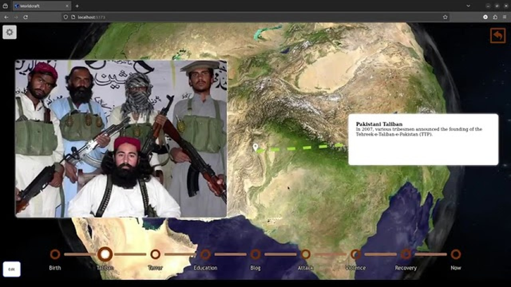
</a>
 
Client: Sandi Toksvig, Mappa Mundi project

Google Earth, Google Maps and Google Streetview have turned surveillance
data into commercial opportunities ranging from Deliveroo to Down My
Street. But coverage tends to focus on sponsored business opportunities,
rather than the livelihoods and communities of real women and men. Your
task is to prototype an infrastructure of an interactive globe, where
viewers can fluidly zoom in to connect to people's "best self", using
their own verified images to represent their streets, homes and
families. You’ll have the opportunity to share ideas with a leading game
developer, on how to make the world fairer and more peaceful.

